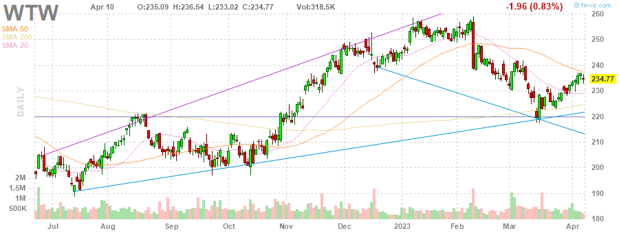
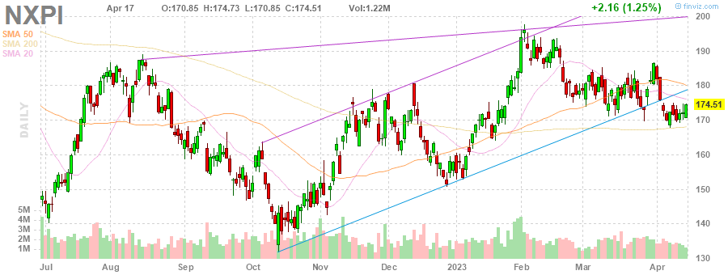
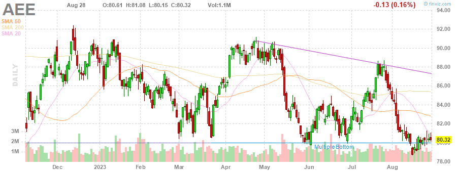

# MarksMan 

MarksMan is an automated bot for the U.S. Stock Market that can trade options using a custom quant algorithm. The bot is capable of reading and detecting alerts in real time, scan for unusual volumes, play options based on unusual options flow and take profits at its liking. Additionally, the bot is capable to detect several chart patterns across S&P500 and NASDAQ100 Markets, generate charts and labels, get OI/Volume for each stock and get real time options ask/bid.

# Daily Newsletter
*Last Updated: 2023-04-05 08:30:00.566311*
---
# BULLISH STOCKS
---
Inverse Head and Shoulders

(1) AAPL - Apple Inc.

---
**Double Bottom Pattern**

(1) LYV - Live Nation Entertainment, Inc.

(2) DXC - DXC Technology Company

(3) CCI - Crown Castle Inc.

(4) INTC - Intel Corporation

---
**Falling Wedge Pattern**

(1) ACN - Accenture plc

(2) JKHY - Jack Henry & Associates, Inc.

(3) COST - Costco Wholesale Corporation

---
**Trendline Support**

(1) MPC - Marathon Petroleum Corporation

(2) HLT - Hilton Worldwide Holdings Inc.

(3) NCLH - Norwegian Cruise Line Holdings Ltd.

(4) EQR - Equity Residential

(5) WTW - Willis Towers Watson Public Limited Company

(6) FISV - Fiserv, Inc.

---
**Horizontal S/R**

(1) CLX - The Clorox Company

(2) CCL - Carnival Corporation & plc

(3) TT - Trane Technologies plc

---
**Oversold Stock**

(1) FRC - First Republic Bank

---

# BEARISH STOCKS 
---

---
**Head and Shoulders Pattern**

(1) HAL - Halliburton Company

(2) BIIB - Biogen Inc.

(3) ALB - Albemarle Corporation

---
**Multiple Top**

(1) BA - The Boeing Company

(2) HBAN - Huntington Bancshares Incorporated

(3) DXCM - DexCom, Inc.

(4) ROST - Ross Stores, Inc.

---
**Double Top Pattern**

(1) ORLY - O'Reilly Automotive, Inc.

(2) PSX - Phillips 66

(3) NCLH - Norwegian Cruise Line Holdings Ltd.

(4) CVX - Chevron Corporation

(5) NUE - Nucor Corporation

(6) AZO - AutoZone, Inc.

(7) VRTX - Vertex Pharmaceuticals Incorporated

---
**Ascending Channel Pattern**

(1) TDY - Teledyne Technologies Incorporated

(2) APH - Amphenol Corporation

(3) VRSK - Verisk Analytics, Inc.

(4) NVR - NVR, Inc.

(5) NXPI - NXP Semiconductors N.V.

---
**Rising Wedge Pattern**

(1) LIN - Linde plc

(2) CSCO - Cisco Systems, Inc.

(3) PWR - Quanta Services, Inc.

(4) TTWO - Take-Two Interactive Software, Inc.

(5) AMAT - Applied Materials, Inc.

---
**Trendline Resistance**

(1) ED - Consolidated Edison, Inc.

(2) TDY - Teledyne Technologies Incorporated

(3) AEE - Ameren Corporation

(4) PWR - Quanta Services, Inc.

(5) TSCO - Tractor Supply Company

(6) CSCO - Cisco Systems, Inc.

(7) CBOE - Cboe Global Markets, Inc.

---
**Horizontal S/R**. It can be played as bearish if stock loses the support

(1) CLX - The Clorox Company

(2) CCL - Carnival Corporation & plc

(3) TT - Trane Technologies plc

---
