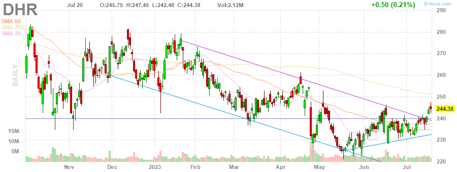
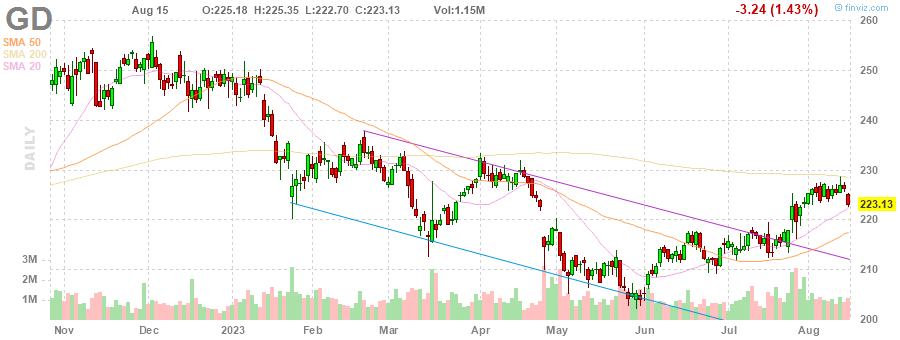
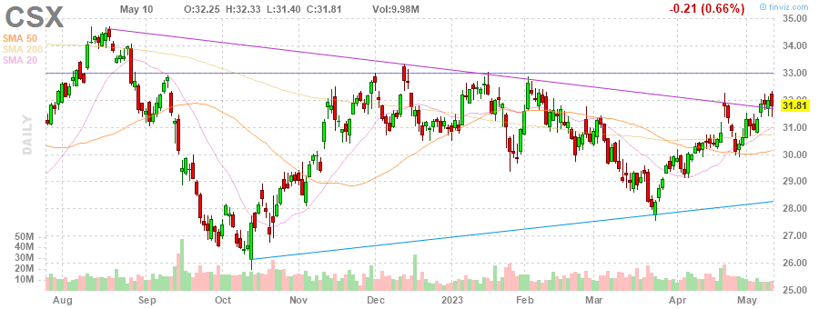

# MarksMan 

MarksMan is an automated bot for the U.S. Stock Market that can trade options using a custom quant algorithm. The bot is capable of reading and detecting alerts in real time, scan for unusual volumes, play options based on unusual options flow and take profits at its liking. Additionally, the bot is capable to detect several chart patterns across S&P500 and NASDAQ100 Markets, generate charts and labels, get OI/Volume for each stock and get real time options ask/bid.

# Daily Newsletter
*Last Updated: 2023-04-27 08:30:00.571558*
---
# BULLISH STOCKS
---
Inverse Head and Shoulders

(1) AAPL - Apple Inc.

---
**Multiple Bottoms**

(1) CTLT - Catalent, Inc.

(2) MDT - Medtronic plc

---
**Double Bottom Pattern**

(1) CMA - Comerica Incorporated

(2) STZ - Constellation Brands, Inc.

(3) WHR - Whirlpool Corporation

(4) SEE - Sealed Air Corporation

---
**Descending Channel Pattern**

(1) DHR - Danaher Corporation

(2) TSN - Tyson Foods, Inc.

(3) IEX - IDEX Corporation

---
**Falling Wedge Pattern**

(1) AAP - Advance Auto Parts, Inc.

(2) ACN - Accenture plc

(3) JKHY - Jack Henry & Associates, Inc.

---
**Trendline Support**

(1) PAYC - Paycom Software, Inc.

(2) HLT - Hilton Worldwide Holdings Inc.

---
**Horizontal S/R**

(1) UDR - UDR, Inc.

(2) FDS - FactSet Research Systems Inc.

(3) GRMN - Garmin Ltd.

(4) CAH - Cardinal Health, Inc.

---

# BEARISH STOCKS 
---

---
**Head and Shoulders Pattern**

(1) UAL - United Airlines Holdings, Inc.

(2) STT - State Street Corporation

(3) HAL - Halliburton Company

(4) KLAC - KLA Corporation

(5) NFLX - Netflix, Inc.

(6) TRV - The Travelers Companies, Inc.

(7) GD - General Dynamics Corporation

(8) ALK - Alaska Air Group, Inc.

---
**Multiple Top**

(1) CTAS - Cintas Corporation

(2) BA - The Boeing Company

(3) LMT - Lockheed Martin Corporation

(4) HBAN - Huntington Bancshares Incorporated

(5) ROST - Ross Stores, Inc.

(6) GL - Globe Life Inc.

---
**Double Top Pattern**

(1) WYNN - Wynn Resorts, Limited

(2) MGM - MGM Resorts International

(3) IDXX - IDEXX Laboratories, Inc.

(4) NCLH - Norwegian Cruise Line Holdings Ltd.

(5) NUE - Nucor Corporation

---
**Ascending Channel Pattern**

(1) TDY - Teledyne Technologies Incorporated

(2) CCL - Carnival Corporation & plc

---
**Rising Wedge Pattern**

(1) APH - Amphenol Corporation

(2) PWR - Quanta Services, Inc.

(3) ULTA - Ulta Beauty, Inc.

(4) DRI - Darden Restaurants, Inc.

(5) TTWO - Take-Two Interactive Software, Inc.

(6) SNPS - Synopsys, Inc.

---
**Ascending Triangle**

(1) BG - Bunge Limited

---
**Trendline Resistance**

(1) CLX - The Clorox Company

(2) AEE - Ameren Corporation

(3) CSX - CSX Corporation

---
**Horizontal S/R**. It can be played as bearish if stock loses the support

(1) UDR - UDR, Inc.

(2) FDS - FactSet Research Systems Inc.

(3) GRMN - Garmin Ltd.

(4) CAH - Cardinal Health, Inc.

---
**Overbought Stock**

(1) CMG - Chipotle Mexican Grill, Inc.

(2) TAP - Molson Coors Beverage Company

---
