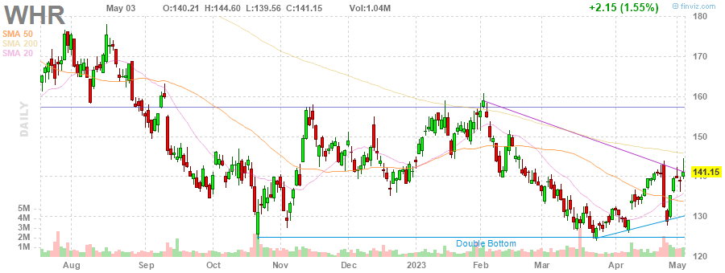
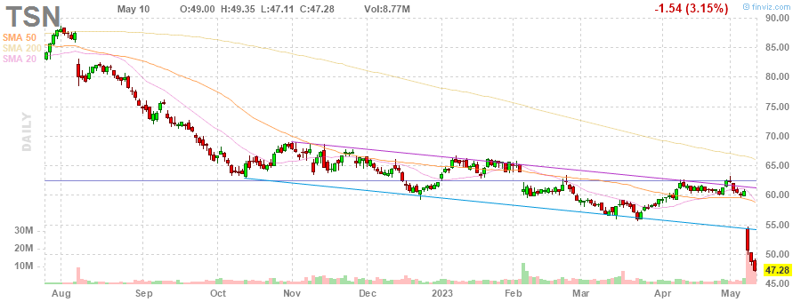
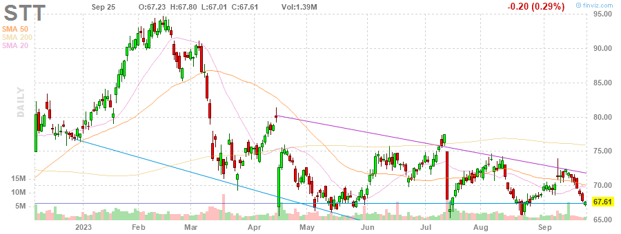
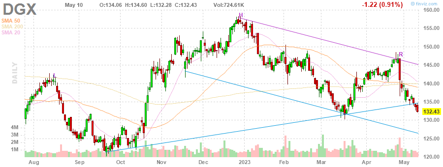
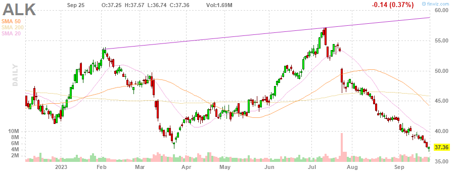
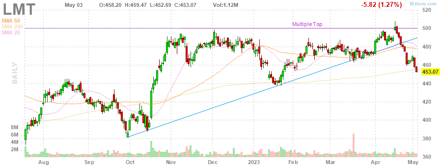

# MarksMan 

MarksMan is an automated bot for the U.S. Stock Market that can trade options using a custom quant algorithm. The bot is capable of reading and detecting alerts in real time, scan for unusual volumes, play options based on unusual options flow and take profits at its liking. Additionally, the bot is capable to detect several chart patterns across S&P500 and NASDAQ100 Markets, generate charts and labels, get OI/Volume for each stock and get real time options ask/bid.

# Daily Newsletter
*Last Updated: 2023-05-02 08:30:00.102408*
---
# BULLISH STOCKS
---
Inverse Head and Shoulders

(1) AAPL - Apple Inc.

---
**Multiple Bottoms**

(1) LYV - Live Nation Entertainment, Inc.

(2) CTLT - Catalent, Inc.

(3) NRG - NRG Energy, Inc.

(4) MDT - Medtronic plc

---
**Double Bottom Pattern**

(1) SEE - Sealed Air Corporation

(2) WHR - Whirlpool Corporation

---
**Descending Channel Pattern**

(1) DHR - Danaher Corporation

(2) TSN - Tyson Foods, Inc.

(3) DISH - DISH Network Corporation

(4) JKHY - Jack Henry & Associates, Inc.

(5) IEX - IDEX Corporation

---
**Falling Wedge Pattern**

(1) AAP - Advance Auto Parts, Inc.

(2) PAYX - Paychex, Inc.

---
**Descending Triangle Pattern**

(1) FTV - Fortive Corporation

---
**Horizontal S/R**

(1) ODFL - Old Dominion Freight Line, Inc.

---
**Oversold Stock**

(1) FRC - First Republic Bank

---

# BEARISH STOCKS 
---

---
**Head and Shoulders Pattern**

(1) UAL - United Airlines Holdings, Inc.

(2) HAL - Halliburton Company

(3) SLB - Schlumberger Limited

(4) STT - State Street Corporation

(5) HLT - Hilton Worldwide Holdings Inc.

(6) KLAC - KLA Corporation

(7) NFLX - Netflix, Inc.

(8) DGX - Quest Diagnostics Incorporated

(9) ALK - Alaska Air Group, Inc.

(10) TRV - The Travelers Companies, Inc.

---
**Multiple Top**

(1) CTAS - Cintas Corporation

(2) BA - The Boeing Company

(3) LMT - Lockheed Martin Corporation

(4) HBAN - Huntington Bancshares Incorporated

(5) ROST - Ross Stores, Inc.

(6) GL - Globe Life Inc.

(7) WFC - Wells Fargo & Company

---
**Double Top Pattern**

(1) ALGN - Align Technology, Inc.

(2) NCLH - Norwegian Cruise Line Holdings Ltd.

(3) NUE - Nucor Corporation

(4) V - Visa Inc.

---
**Ascending Channel Pattern**

(1) TDY - Teledyne Technologies Incorporated

(2) CCL - Carnival Corporation & plc

(3) ORLY - O'Reilly Automotive, Inc.

---
**Rising Wedge Pattern**

(1) PWR - Quanta Services, Inc.

(2) DXCM - DexCom, Inc.

(3) ULTA - Ulta Beauty, Inc.

(4) SNPS - Synopsys, Inc.

(5) BKNG - Booking Holdings Inc.

(6) META - Meta Platforms, Inc.

---
**Ascending Triangle**

(1) BG - Bunge Limited

---
**Trendline Resistance**

(1) CLX - The Clorox Company

(2) CSX - CSX Corporation

(3) ES - Eversource Energy

---
**Horizontal S/R**. It can be played as bearish if stock loses the support

(1) ODFL - Old Dominion Freight Line, Inc.

---
**Overbought Stock**

(1) MDLZ - Mondelez International, Inc.

(2) TAP - Molson Coors Beverage Company

(3) HSY - The Hershey Company

(4) BRO - Brown & Brown, Inc.

(5) SBUX - Starbucks Corporation

(6) CMG - Chipotle Mexican Grill, Inc.

---
