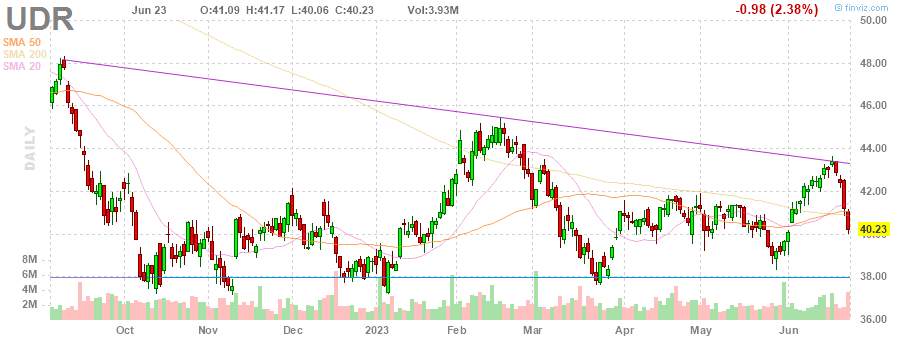
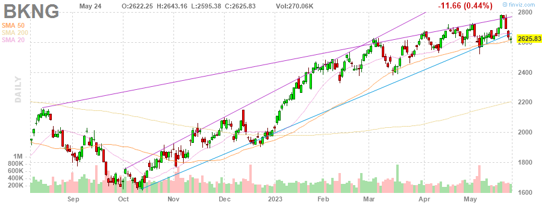

# MarksMan 

MarksMan is an automated bot for the U.S. Stock Market that can trade options using a custom quant algorithm. The bot is capable of reading and detecting alerts in real time, scan for unusual volumes, play options based on unusual options flow and take profits at its liking. Additionally, the bot is capable to detect several chart patterns across S&P500 and NASDAQ100 Markets, generate charts and labels, get OI/Volume for each stock and get real time options ask/bid.

# Daily Newsletter
*Last Updated: 2023-05-03 08:30:00.112619*
---
# BULLISH STOCKS
---
Inverse Head and Shoulders

(1) AAPL - Apple Inc.

---
**Multiple Bottoms**

(1) LYV - Live Nation Entertainment, Inc.

(2) CTLT - Catalent, Inc.

(3) MDT - Medtronic plc

---
**Double Bottom Pattern**

(1) WHR - Whirlpool Corporation

---
**Descending Channel Pattern**

(1) DHR - Danaher Corporation

(2) TSN - Tyson Foods, Inc.

(3) JKHY - Jack Henry & Associates, Inc.

(4) DISH - DISH Network Corporation

(5) IEX - IDEX Corporation

---
**Falling Wedge Pattern**

(1) AAP - Advance Auto Parts, Inc.

(2) PAYX - Paychex, Inc.

---
**Descending Triangle Pattern**

(1) FTV - Fortive Corporation

---
**Trendline Support**

(1) UDR - UDR, Inc.

---
**Horizontal S/R**

(1) FDS - FactSet Research Systems Inc.

(2) UDR - UDR, Inc.

(3) ODFL - Old Dominion Freight Line, Inc.

---

# BEARISH STOCKS 
---

---
**Head and Shoulders Pattern**

(1) NFLX - Netflix, Inc.

(2) UAL - United Airlines Holdings, Inc.

(3) HAL - Halliburton Company

(4) KLAC - KLA Corporation

(5) SLB - Schlumberger Limited

(6) STT - State Street Corporation

(7) DGX - Quest Diagnostics Incorporated

(8) ALK - Alaska Air Group, Inc.

(9) TRV - The Travelers Companies, Inc.

---
**Multiple Top**

(1) WYNN - Wynn Resorts, Limited

(2) UHS - Universal Health Services, Inc.

(3) CTAS - Cintas Corporation

(4) BA - The Boeing Company

(5) LMT - Lockheed Martin Corporation

(6) HBAN - Huntington Bancshares Incorporated

(7) ROST - Ross Stores, Inc.

(8) GL - Globe Life Inc.

(9) XOM - Exxon Mobil Corporation

(10) WFC - Wells Fargo & Company

---
**Double Top Pattern**

(1) ALGN - Align Technology, Inc.

(2) NUE - Nucor Corporation

(3) NCLH - Norwegian Cruise Line Holdings Ltd.

---
**Ascending Channel Pattern**

(1) TDY - Teledyne Technologies Incorporated

(2) CCL - Carnival Corporation & plc

(3) VRTX - Vertex Pharmaceuticals Incorporated

(4) ORLY - O'Reilly Automotive, Inc.

---
**Rising Wedge Pattern**

(1) PWR - Quanta Services, Inc.

(2) DXCM - DexCom, Inc.

(3) ULTA - Ulta Beauty, Inc.

(4) SNPS - Synopsys, Inc.

(5) BKNG - Booking Holdings Inc.

(6) META - Meta Platforms, Inc.

---
**Ascending Triangle**

(1) BG - Bunge Limited

---
**Trendline Resistance**

(1) CLX - The Clorox Company

(2) TFX - Teleflex Incorporated

(3) COST - Costco Wholesale Corporation

(4) CSX - CSX Corporation

(5) DHR - Danaher Corporation

(6) PWR - Quanta Services, Inc.

---
**Horizontal S/R**. It can be played as bearish if stock loses the support

(1) FDS - FactSet Research Systems Inc.

(2) UDR - UDR, Inc.

(3) ODFL - Old Dominion Freight Line, Inc.

---
**Overbought Stock**

(1) TAP - Molson Coors Beverage Company

(2) MDLZ - Mondelez International, Inc.

(3) ZBH - Zimmer Biomet Holdings, Inc.

(4) CMG - Chipotle Mexican Grill, Inc.

(5) SBUX - Starbucks Corporation

(6) MNST - Monster Beverage Corporation

---
