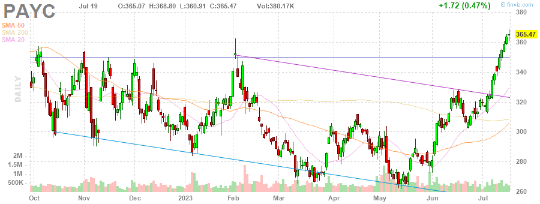
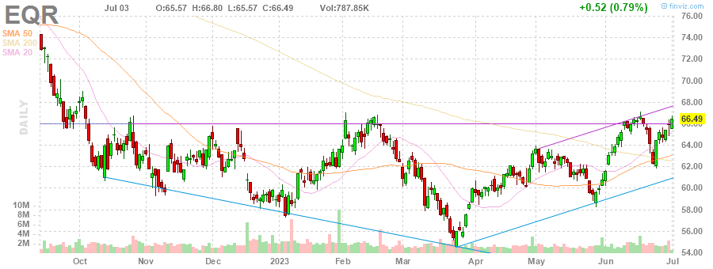
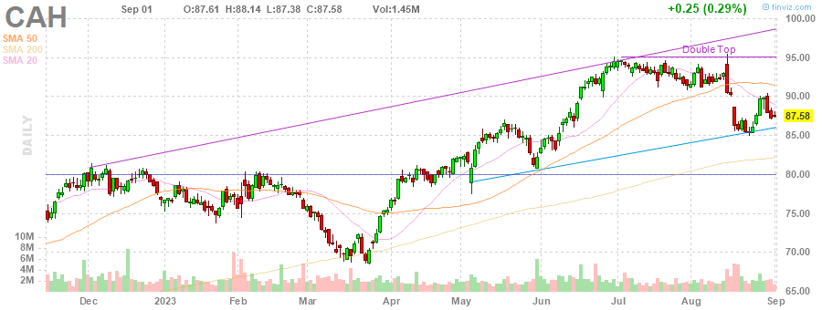
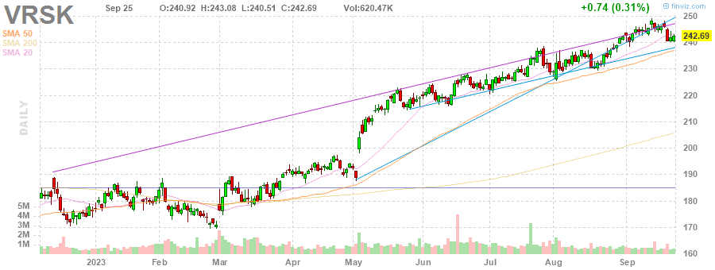
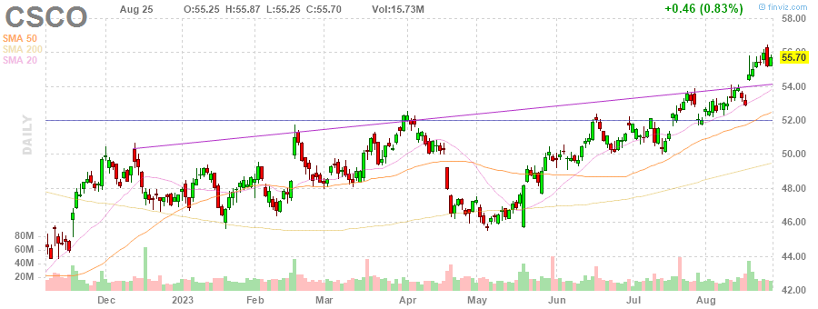

# MarksMan 

MarksMan is an automated bot for the U.S. Stock Market that can trade options using a custom quant algorithm. The bot is capable of reading and detecting alerts in real time, scan for unusual volumes, play options based on unusual options flow and take profits at its liking. Additionally, the bot is capable to detect several chart patterns across S&P500 and NASDAQ100 Markets, generate charts and labels, get OI/Volume for each stock and get real time options ask/bid.

# Daily Newsletter
*Last Updated: 2023-04-06 08:30:00.167679*
---
# BULLISH STOCKS
---
Inverse Head and Shoulders

(1) AAPL - Apple Inc.

---
**Double Bottom Pattern**

(1) SEE - Sealed Air Corporation

(2) LYV - Live Nation Entertainment, Inc.

(3) DXC - DXC Technology Company

(4) CCI - Crown Castle Inc.

(5) INTC - Intel Corporation

---
**Descending Channel Pattern**

(1) IEX - IDEX Corporation

---
**Falling Wedge Pattern**

(1) ACN - Accenture plc

(2) JKHY - Jack Henry & Associates, Inc.

(3) COST - Costco Wholesale Corporation

---
**Trendline Support**

(1) HLT - Hilton Worldwide Holdings Inc.

(2) MPC - Marathon Petroleum Corporation

(3) PAYC - Paycom Software, Inc.

(4) NCLH - Norwegian Cruise Line Holdings Ltd.

(5) EQR - Equity Residential

---
**Horizontal S/R**

(1) UDR - UDR, Inc.

(2) KMB - Kimberly-Clark Corporation

(3) CAH - Cardinal Health, Inc.

(4) FDS - FactSet Research Systems Inc.

---
**Oversold Stock**

(1) FRC - First Republic Bank

---

# BEARISH STOCKS 
---

---
**Head and Shoulders Pattern**

(1) SNA - Snap-on Incorporated

(2) HAL - Halliburton Company

(3) BIIB - Biogen Inc.

(4) ALB - Albemarle Corporation

---
**Multiple Top**

(1) BA - The Boeing Company

(2) HBAN - Huntington Bancshares Incorporated

(3) DXCM - DexCom, Inc.

(4) ROST - Ross Stores, Inc.

---
**Double Top Pattern**

(1) WYNN - Wynn Resorts, Limited

(2) PSX - Phillips 66

(3) CTAS - Cintas Corporation

(4) NCLH - Norwegian Cruise Line Holdings Ltd.

(5) CVX - Chevron Corporation

(6) NUE - Nucor Corporation

(7) VRTX - Vertex Pharmaceuticals Incorporated

(8) AZO - AutoZone, Inc.

---
**Ascending Channel Pattern**

(1) TDY - Teledyne Technologies Incorporated

(2) APH - Amphenol Corporation

(3) VRSK - Verisk Analytics, Inc.

(4) NVR - NVR, Inc.

(5) NXPI - NXP Semiconductors N.V.

---
**Rising Wedge Pattern**

(1) CSCO - Cisco Systems, Inc.

(2) PWR - Quanta Services, Inc.

(3) TTWO - Take-Two Interactive Software, Inc.

(4) AMAT - Applied Materials, Inc.

---
**Trendline Resistance**

(1) TDY - Teledyne Technologies Incorporated

(2) ED - Consolidated Edison, Inc.

(3) CSCO - Cisco Systems, Inc.

(4) CBOE - Cboe Global Markets, Inc.

---
**Horizontal S/R**. It can be played as bearish if stock loses the support

(1) UDR - UDR, Inc.

(2) KMB - Kimberly-Clark Corporation

(3) CAH - Cardinal Health, Inc.

(4) FDS - FactSet Research Systems Inc.

---
**Overbought Stock**

(1) HSY - The Hershey Company

---
