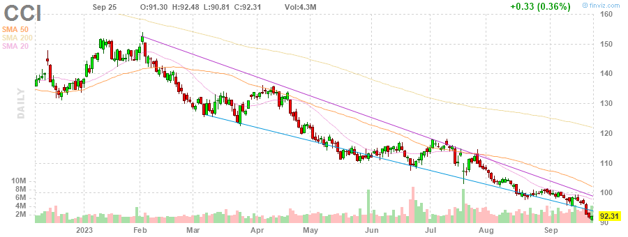
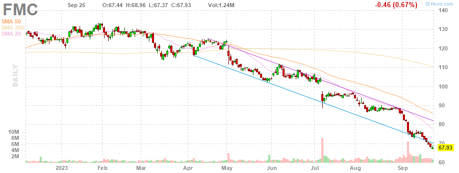
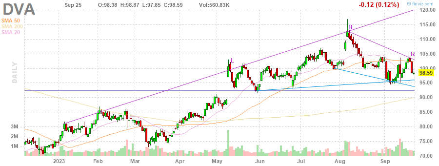
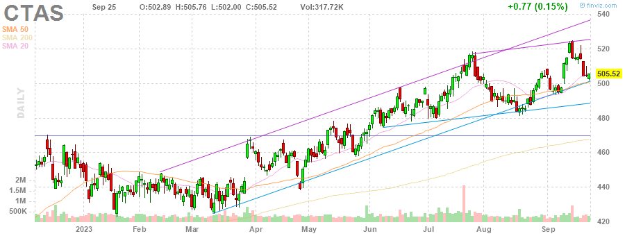
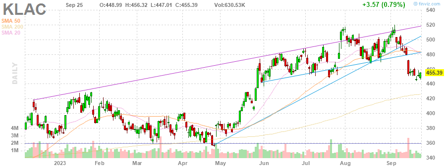
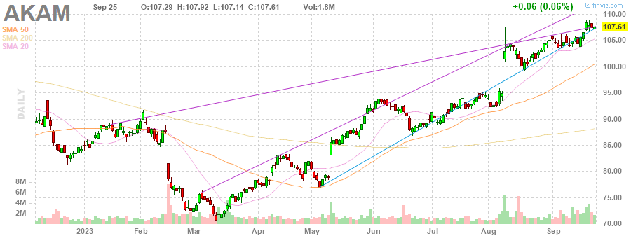

# MarksMan 

MarksMan is an automated bot for the U.S. Stock Market that can trade options using a custom quant algorithm. The bot is capable of reading and detecting alerts in real time, scan for unusual volumes, play options based on unusual options flow and take profits at its liking. Additionally, the bot is capable to detect several chart patterns across S&P500 and NASDAQ100 Markets, generate charts and labels, get OI/Volume for each stock and get real time options ask/bid.

# Daily Newsletter
*Last Updated: September 26, 2023*
---
## Bullish Stocks
---
Inverse Head and Shoulders

(1) CF - CF

(2) BK - BK

---
**Multiple Bottoms**

(1) CNC - CNC

(2) NI - NI

(3) SRE - SRE

(4) WRK - WRK

(5) OXY - OXY

(6) CB - CB

(7) VTR - VTR

---
**Double Bottom Pattern**

(1) PM - PM

(2) NSC - NSC

(3) CVS - CVS

(4) HON - HON

(5) SPG - SPG

---
**Descending Channel Pattern**

(1) VZ - VZ

(2) ENPH - ENPH

(3) ES - ES

(4) FE - FE

---
**Falling Wedge Pattern**

(1) ETR - ETR

(2) BMY - BMY

(3) NOC - NOC

(4) CCI - CCI

(5) SBUX - SBUX

---
**Trendline Support**

(1) LIN - LIN

(2) TTWO - TTWO

(3) ETR - ETR

(4) GE - GE

(5) EIX - EIX

(6) FDX - FDX

(7) MU - MU

---
**Horizontal S/R**

(1) CNC - CNC

(2) FANG - FANG

(3) STT - STT

(4) AOS - AOS

(5) HRL - HRL

(6) BA - BA

---
**Oversold Stock**

(1) FMC - FMC

(2) DLTR - DLTR

(3) ILMN - ILMN

(4) TPR - TPR

(5) DG - DG

(6) O - O

(7) LVS - LVS

(8) RTX - RTX

(9) CLX - CLX

(10) ALK - ALK

---

## Bearish Stocks 
---

---
**Head and Shoulders Pattern**

(1) HCA - HCA

(2) FTNT - FTNT

(3) DVA - DVA

(4) AZO - AZO

(5) ANSS - ANSS

(6) EIX - EIX

---
**Multiple Top**

(1) BSX - BSX

(2) GRMN - GRMN

(3) SNPS - SNPS

(4) ORLY - ORLY

(5) MCD - MCD

(6) MLM - MLM

(7) KR - KR

---
**Double Top Pattern**

(1) NTAP - NTAP

(2) NOW - NOW

(3) ORCL - ORCL

(4) MDT - MDT

(5) APH - APH

---
**Ascending Channel Pattern**

(1) FICO - FICO

(2) WMT - WMT

(3) FDX - FDX

(4) FI - FI

(5) CTAS - CTAS

(6) VRSK - VRSK

(7) TDG - TDG

(8) AMAT - AMAT

(9) KLAC - KLAC

---
**Rising Wedge Pattern**

(1) LIN - LIN

(2) MU - MU

(3) AKAM - AKAM

---
**Ascending Triangle**

(1) GE - GE

---
**Trendline Resistance**

(1) WMT - WMT

(2) FICO - FICO

(3) CBOE - CBOE

(4) ELV - ELV

(5) BMY - BMY

(6) VZ - VZ

(7) LIN - LIN

(8) SRE - SRE

---
**Horizontal S/R**. It can be played as bearish if stock loses the support

(1) CNC - CNC

(2) FANG - FANG

(3) STT - STT

(4) AOS - AOS

(5) HRL - HRL

(6) BA - BA

---
