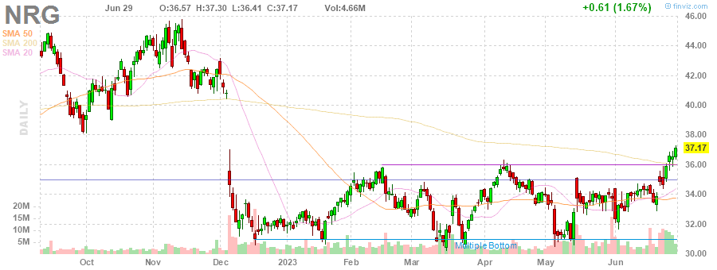
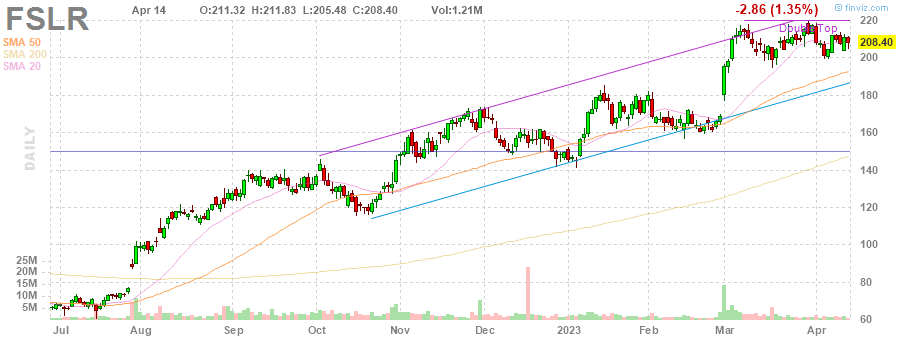
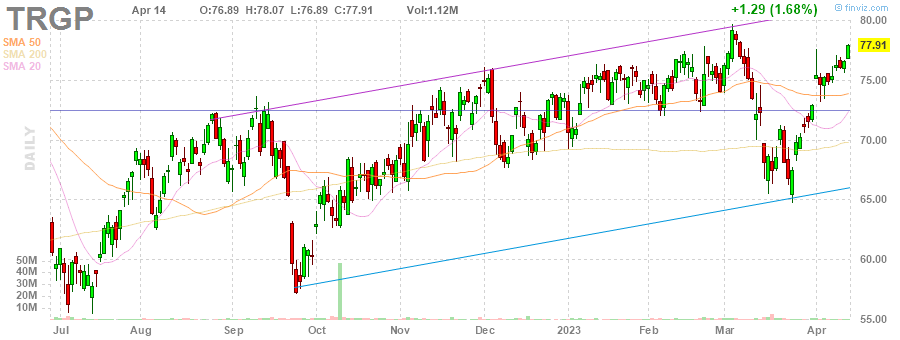

# MarksMan 

MarksMan is an automated bot for the U.S. Stock Market that can trade options using a custom quant algorithm. The bot is capable of reading and detecting alerts in real time, scan for unusual volumes, play options based on unusual options flow and take profits at its liking. Additionally, the bot is capable to detect several chart patterns across S&P500 and NASDAQ100 Markets, generate charts and labels, get OI/Volume for each stock and get real time options ask/bid.

# Daily Newsletter
*Last Updated: 2023-04-14 08:30:00.627205*
---
# BULLISH STOCKS
---
Inverse Head and Shoulders

(1) AAPL - Apple Inc.

---
**Multiple Bottoms**

(1) INTC - Intel Corporation

(2) SWK - Stanley Black & Decker, Inc.

(3) RMD - ResMed Inc.

(4) NRG - NRG Energy, Inc.

(5) MDT - Medtronic plc

---
**Double Bottom Pattern**

(1) DTE - DTE Energy Company

(2) CMA - Comerica Incorporated

(3) CCI - Crown Castle Inc.

(4) LYV - Live Nation Entertainment, Inc.

(5) SEE - Sealed Air Corporation

(6) WHR - Whirlpool Corporation

(7) STZ - Constellation Brands, Inc.

(8) SBAC - SBA Communications Corporation

(9) CHRW - C.H. Robinson Worldwide, Inc.

---
**Descending Channel Pattern**

(1) IEX - IDEX Corporation

(2) NI - NiSource Inc.

---
**Falling Wedge Pattern**

(1) ACN - Accenture plc

(2) JKHY - Jack Henry & Associates, Inc.

---
**Descending Triangle Pattern**

(1) FDS - FactSet Research Systems Inc.

---
**Trendline Support**

(1) MPC - Marathon Petroleum Corporation

(2) NCLH - Norwegian Cruise Line Holdings Ltd.

(3) UDR - UDR, Inc.

(4) AAP - Advance Auto Parts, Inc.

---
**Horizontal S/R**

(1) UDR - UDR, Inc.

(2) CAH - Cardinal Health, Inc.

---
**Oversold Stock**

(1) FRC - First Republic Bank

---

# BEARISH STOCKS 
---

---
**Head and Shoulders Pattern**

(1) SNA - Snap-on Incorporated

(2) KLAC - KLA Corporation

(3) HAL - Halliburton Company

(4) BIIB - Biogen Inc.

---
**Multiple Top**

(1) LMT - Lockheed Martin Corporation

(2) HBAN - Huntington Bancshares Incorporated

(3) DXCM - DexCom, Inc.

(4) ROST - Ross Stores, Inc.

(5) BA - The Boeing Company

(6) GL - Globe Life Inc.

(7) WFC - Wells Fargo & Company

---
**Double Top Pattern**

(1) FSLR - First Solar, Inc.

(2) CTAS - Cintas Corporation

(3) CVX - Chevron Corporation

(4) NUE - Nucor Corporation

(5) WYNN - Wynn Resorts, Limited

(6) PSX - Phillips 66

---
**Ascending Channel Pattern**

(1) TDY - Teledyne Technologies Incorporated

(2) CCL - Carnival Corporation & plc

(3) APH - Amphenol Corporation

(4) VRSK - Verisk Analytics, Inc.

(5) NVR - NVR, Inc.

(6) NXPI - NXP Semiconductors N.V.

---
**Rising Wedge Pattern**

(1) MPC - Marathon Petroleum Corporation

(2) BSX - Boston Scientific Corporation

(3) PWR - Quanta Services, Inc.

(4) CSCO - Cisco Systems, Inc.

(5) DRI - Darden Restaurants, Inc.

(6) TTWO - Take-Two Interactive Software, Inc.

(7) SNPS - Synopsys, Inc.

(8) AMAT - Applied Materials, Inc.

---
**Trendline Resistance**

(1) TDY - Teledyne Technologies Incorporated

(2) ED - Consolidated Edison, Inc.

(3) CLX - The Clorox Company

(4) PNW - Pinnacle West Capital Corporation

(5) TRGP - Targa Resources Corp.

---
**Horizontal S/R**. It can be played as bearish if stock loses the support

(1) UDR - UDR, Inc.

(2) CAH - Cardinal Health, Inc.

---
