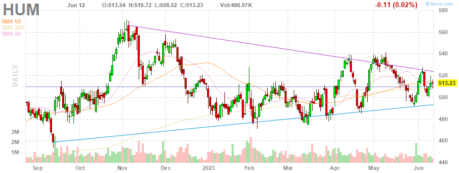
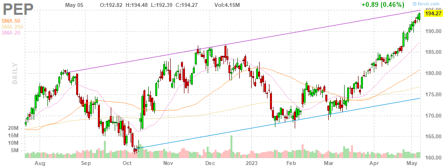
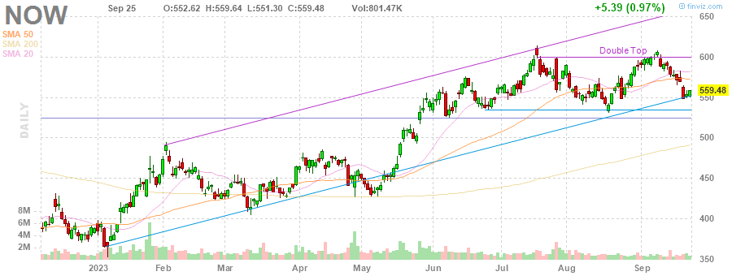
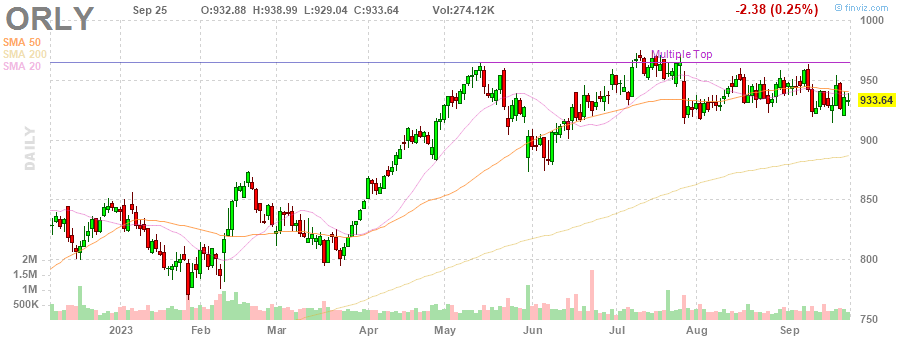

# MarksMan 

MarksMan is an automated bot for the U.S. Stock Market that can trade options using a custom quant algorithm. The bot is capable of reading and detecting alerts in real time, scan for unusual volumes, play options based on unusual options flow and take profits at its liking. Additionally, the bot is capable to detect several chart patterns across S&P500 and NASDAQ100 Markets, generate charts and labels, get OI/Volume for each stock and get real time options ask/bid.

# Daily Newsletter
*Last Updated: 2023-03-26 13:45:01.658775*
---
# BULLISH STOCKS
---
**Multiple Bottoms**

(1) UDR - UDR, Inc.

(2) MDT - Medtronic plc

(3) SWK - Stanley Black & Decker, Inc.

---
**Double Bottom Pattern**

(1) INTC - Intel Corporation

(2) SBAC - SBA Communications Corporation

(3) MKC - McCormick & Company, Incorporated

(4) CHRW - C.H. Robinson Worldwide, Inc.

---
**Falling Wedge Pattern**

(1) SO - The Southern Company

(2) COST - Costco Wholesale Corporation

(3) ACN - Accenture plc

(4) JKHY - Jack Henry & Associates, Inc.

(5) MCD - McDonald's Corporation

---
**Descending Triangle Pattern**

(1) FDS - FactSet Research Systems Inc.

(2) HUM - Humana Inc.

(3) PSX - Phillips 66

---
**Trendline Support**

(1) PRU - Prudential Financial, Inc.

(2) NWS - News Corporation

(3) LHX - L3Harris Technologies, Inc.

(4) PEP - PepsiCo, Inc.

(5) GS - The Goldman Sachs Group, Inc.

(6) AFL - Aflac Incorporated

---
**Horizontal S/R**

(1) NOW - ServiceNow, Inc.

(2) NWS - News Corporation

(3) MU - Micron Technology, Inc.

(4) PEG - Public Service Enterprise Group Incorporated

---
**Oversold Stock**

(1) FRC - First Republic Bank

(2) AAP - Advance Auto Parts, Inc.

(3) LUMN - Lumen Technologies, Inc.

---

# BEARISH STOCKS 
---

---
**Head and Shoulders Pattern**

(1) ILMN - Illumina, Inc.

(2) BIIB - Biogen Inc.

(3) ALB - Albemarle Corporation

(4) ABBV - AbbVie Inc.

---
**Multiple Top**

(1) DXCM - DexCom, Inc.

(2) ROST - Ross Stores, Inc.

(3) MNST - Monster Beverage Corporation

(4) HBAN - Huntington Bancshares Incorporated

---
**Double Top Pattern**

(1) NUE - Nucor Corporation

(2) AZO - AutoZone, Inc.

(3) VRTX - Vertex Pharmaceuticals Incorporated

(4) ORLY - O'Reilly Automotive, Inc.

(5) PSX - Phillips 66

---
**Ascending Channel Pattern**

(1) VRSK - Verisk Analytics, Inc.

(2) PWR - Quanta Services, Inc.

(3) TDY - Teledyne Technologies Incorporated

(4) APH - Amphenol Corporation

(5) NVR - NVR, Inc.

---
**Rising Wedge Pattern**

(1) LIN - Linde plc

(2) AMAT - Applied Materials, Inc.

(3) TTWO - Take-Two Interactive Software, Inc.

(4) BIO - Bio-Rad Laboratories, Inc.

---
**Trendline Resistance**

(1) ED - Consolidated Edison, Inc.

(2) PWR - Quanta Services, Inc.

(3) AEE - Ameren Corporation

(4) CBOE - Cboe Global Markets, Inc.

---
**Horizontal S/R**. It can be played as bearish if stock loses the support

(1) NOW - ServiceNow, Inc.

(2) NWS - News Corporation

(3) MU - Micron Technology, Inc.

(4) PEG - Public Service Enterprise Group Incorporated

---
