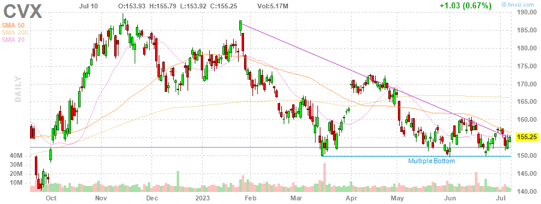
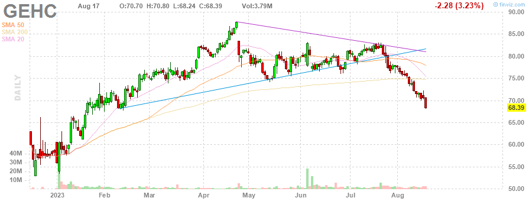

# MarksMan 

MarksMan is an automated bot for the U.S. Stock Market that can trade options using a custom quant algorithm. The bot is capable of reading and detecting alerts in real time, scan for unusual volumes, play options based on unusual options flow and take profits at its liking. Additionally, the bot is capable to detect several chart patterns across S&P500 and NASDAQ100 Markets, generate charts and labels, get OI/Volume for each stock and get real time options ask/bid.

# Daily Newsletter
*Last Updated: 2023-04-26 08:30:00.557887*
---
# BULLISH STOCKS
---
Inverse Head and Shoulders

(1) AAPL - Apple Inc.

---
**Multiple Bottoms**

(1) NRG - NRG Energy, Inc.

(2) INTC - Intel Corporation

(3) FTNT - Fortinet, Inc.

(4) CTLT - Catalent, Inc.

(5) SWK - Stanley Black & Decker, Inc.

(6) MDT - Medtronic plc

---
**Double Bottom Pattern**

(1) CCI - Crown Castle Inc.

(2) DLR - Digital Realty Trust, Inc.

(3) STZ - Constellation Brands, Inc.

(4) CMA - Comerica Incorporated

(5) WHR - Whirlpool Corporation

(6) DTE - DTE Energy Company

---
**Descending Channel Pattern**

(1) IEX - IDEX Corporation

---
**Falling Wedge Pattern**

(1) ACN - Accenture plc

(2) JKHY - Jack Henry & Associates, Inc.

---
**Descending Triangle Pattern**

(1) FDS - FactSet Research Systems Inc.

---
**Horizontal S/R**

(1) AWK - American Water Works Company, Inc.

(2) ODFL - Old Dominion Freight Line, Inc.

(3) CAH - Cardinal Health, Inc.

---

# BEARISH STOCKS 
---

---
**Head and Shoulders Pattern**

(1) UAL - United Airlines Holdings, Inc.

(2) STT - State Street Corporation

(3) HAL - Halliburton Company

(4) KLAC - KLA Corporation

(5) NFLX - Netflix, Inc.

---
**Multiple Top**

(1) CTAS - Cintas Corporation

(2) LMT - Lockheed Martin Corporation

(3) HBAN - Huntington Bancshares Incorporated

(4) ROST - Ross Stores, Inc.

(5) BA - The Boeing Company

(6) WFC - Wells Fargo & Company

(7) GL - Globe Life Inc.

---
**Double Top Pattern**

(1) WYNN - Wynn Resorts, Limited

(2) NCLH - Norwegian Cruise Line Holdings Ltd.

(3) NUE - Nucor Corporation

(4) CVX - Chevron Corporation

---
**Ascending Channel Pattern**

(1) TDY - Teledyne Technologies Incorporated

(2) CCL - Carnival Corporation & plc

(3) VRSK - Verisk Analytics, Inc.

(4) NVR - NVR, Inc.

---
**Rising Wedge Pattern**

(1) APH - Amphenol Corporation

(2) PWR - Quanta Services, Inc.

(3) ULTA - Ulta Beauty, Inc.

(4) DRI - Darden Restaurants, Inc.

(5) GEHC - GE HealthCare Technologies Inc.

(6) SNPS - Synopsys, Inc.

(7) TTWO - Take-Two Interactive Software, Inc.

---
**Ascending Triangle**

(1) BG - Bunge Limited

---
**Trendline Resistance**

(1) CLX - The Clorox Company

(2) ES - Eversource Energy

(3) AMT - American Tower Corporation

---
**Horizontal S/R**. It can be played as bearish if stock loses the support

(1) AWK - American Water Works Company, Inc.

(2) ODFL - Old Dominion Freight Line, Inc.

(3) CAH - Cardinal Health, Inc.

---
**Overbought Stock**

(1) KMB - Kimberly-Clark Corporation

(2) PHM - PulteGroup, Inc.

---
