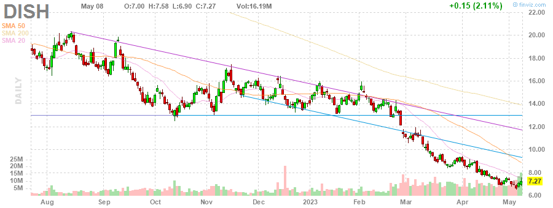
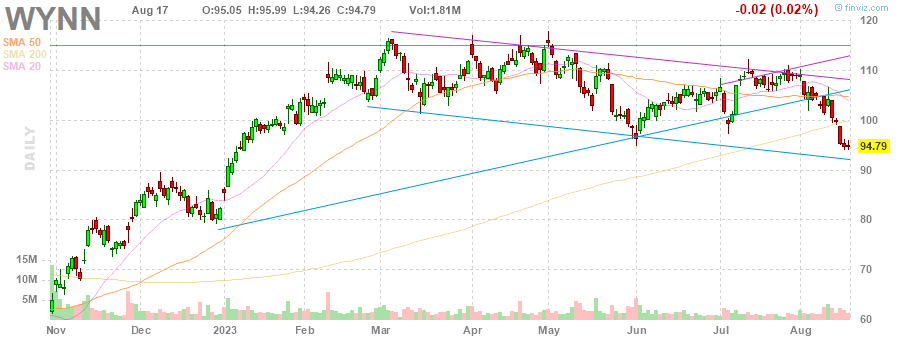
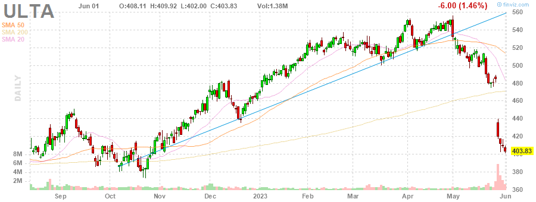
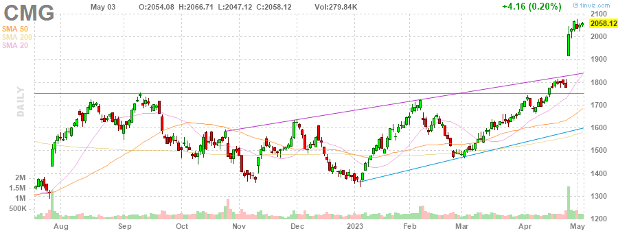
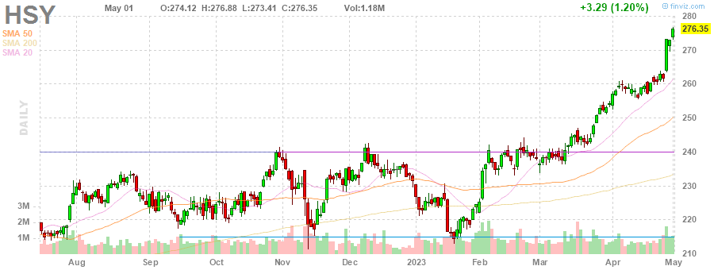

# MarksMan 

MarksMan is an automated bot for the U.S. Stock Market that can trade options using a custom quant algorithm. The bot is capable of reading and detecting alerts in real time, scan for unusual volumes, play options based on unusual options flow and take profits at its liking. Additionally, the bot is capable to detect several chart patterns across S&P500 and NASDAQ100 Markets, generate charts and labels, get OI/Volume for each stock and get real time options ask/bid.

# Daily Newsletter
*Last Updated: 2023-04-28 08:30:00.569341*
---
# BULLISH STOCKS
---
Inverse Head and Shoulders

(1) AAPL - Apple Inc.

---
**Multiple Bottoms**

(1) MDT - Medtronic plc

---
**Double Bottom Pattern**

(1) WHR - Whirlpool Corporation

---
**Descending Channel Pattern**

(1) TSN - Tyson Foods, Inc.

(2) DHR - Danaher Corporation

(3) DISH - DISH Network Corporation

(4) IEX - IDEX Corporation

---
**Falling Wedge Pattern**

(1) AAP - Advance Auto Parts, Inc.

---
**Trendline Support**

(1) HLT - Hilton Worldwide Holdings Inc.

---
**Horizontal S/R**

(1) GRMN - Garmin Ltd.

---

# BEARISH STOCKS 
---

---
**Head and Shoulders Pattern**

(1) SLB - Schlumberger Limited

(2) HAL - Halliburton Company

(3) UAL - United Airlines Holdings, Inc.

(4) STT - State Street Corporation

(5) HLT - Hilton Worldwide Holdings Inc.

(6) KLAC - KLA Corporation

(7) NFLX - Netflix, Inc.

(8) ALK - Alaska Air Group, Inc.

(9) TRV - The Travelers Companies, Inc.

(10) GD - General Dynamics Corporation

---
**Multiple Top**

(1) WYNN - Wynn Resorts, Limited

(2) CTAS - Cintas Corporation

(3) BA - The Boeing Company

(4) LMT - Lockheed Martin Corporation

(5) HBAN - Huntington Bancshares Incorporated

(6) ROST - Ross Stores, Inc.

(7) GL - Globe Life Inc.

---
**Double Top Pattern**

(1) MGM - MGM Resorts International

(2) NCLH - Norwegian Cruise Line Holdings Ltd.

(3) NUE - Nucor Corporation

---
**Ascending Channel Pattern**

(1) TDY - Teledyne Technologies Incorporated

(2) CCL - Carnival Corporation & plc

---
**Rising Wedge Pattern**

(1) APH - Amphenol Corporation

(2) PWR - Quanta Services, Inc.

(3) ULTA - Ulta Beauty, Inc.

(4) SNPS - Synopsys, Inc.

(5) META - Meta Platforms, Inc.

---
**Ascending Triangle**

(1) BG - Bunge Limited

---
**Trendline Resistance**

(1) CLX - The Clorox Company

(2) AMT - American Tower Corporation

(3) CSX - CSX Corporation

---
**Horizontal S/R**. It can be played as bearish if stock loses the support

(1) GRMN - Garmin Ltd.

---
**Overbought Stock**

(1) CMG - Chipotle Mexican Grill, Inc.

(2) CHD - Church & Dwight Co., Inc.

(3) PHM - PulteGroup, Inc.

(4) KMB - Kimberly-Clark Corporation

(5) HSY - The Hershey Company

---
