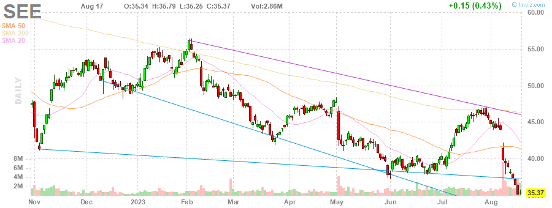
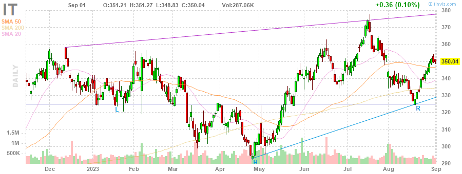
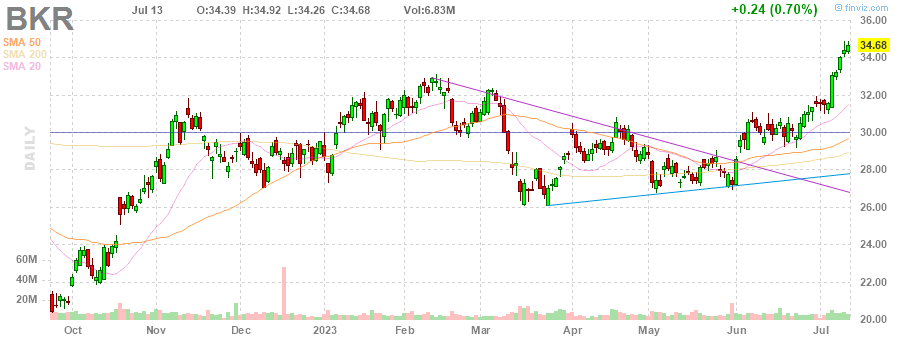
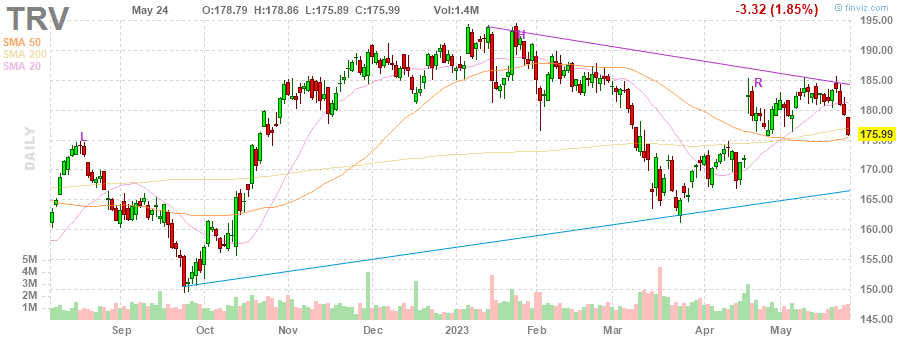
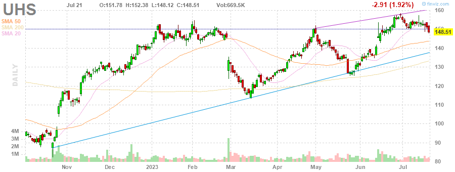
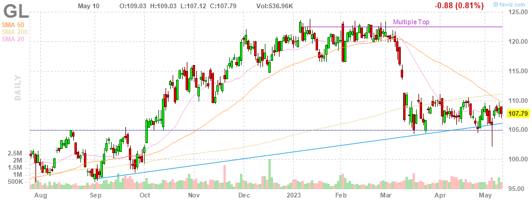
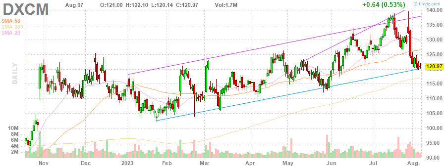
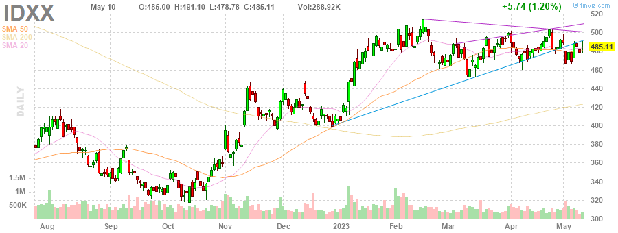
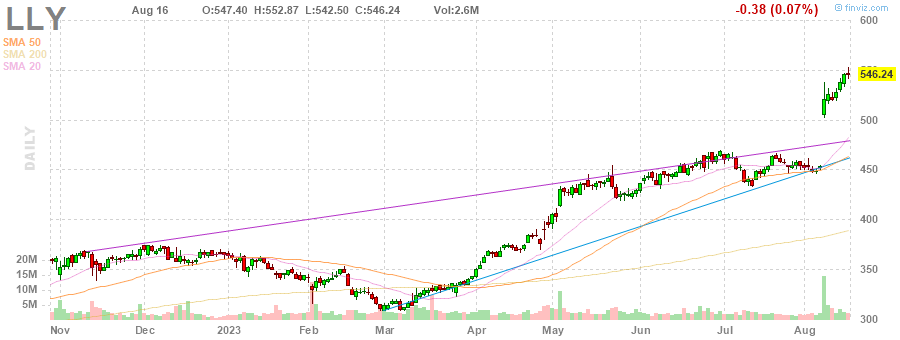

# MarksMan 

MarksMan is an automated bot for the U.S. Stock Market that can trade options using a custom quant algorithm. The bot is capable of reading and detecting alerts in real time, scan for unusual volumes, play options based on unusual options flow and take profits at its liking. Additionally, the bot is capable to detect several chart patterns across S&P500 and NASDAQ100 Markets, generate charts and labels, get OI/Volume for each stock and get real time options ask/bid.

# Daily Newsletter
*Last Updated: 2023-05-08 08:30:00.070567*
---
# BULLISH STOCKS
---
Inverse Head and Shoulders

(1) AAPL - Apple Inc.

---
**Multiple Bottoms**

(1) LYV - Live Nation Entertainment, Inc.

(2) CTLT - Catalent, Inc.

(3) MDT - Medtronic plc

---
**Double Bottom Pattern**

(1) MTB - M&T Bank Corporation

(2) SEE - Sealed Air Corporation

---
**Descending Channel Pattern**

(1) DHR - Danaher Corporation

(2) TSN - Tyson Foods, Inc.

(3) DISH - DISH Network Corporation

(4) IEX - IDEX Corporation

---
**Falling Wedge Pattern**

(1) AAP - Advance Auto Parts, Inc.

(2) PAYX - Paychex, Inc.

(3) IT - Gartner, Inc.

---
**Trendline Support**

(1) PAYC - Paycom Software, Inc.

(2) PNR - Pentair plc

---
**Horizontal S/R**

(1) IRM - Iron Mountain Incorporated

(2) FDS - FactSet Research Systems Inc.

(3) ODFL - Old Dominion Freight Line, Inc.

---

# BEARISH STOCKS 
---

---
**Head and Shoulders Pattern**

(1) STLD - Steel Dynamics, Inc.

(2) NFLX - Netflix, Inc.

(3) T - AT&T Inc.

(4) UAL - United Airlines Holdings, Inc.

(5) BKR - Baker Hughes Company

(6) KLAC - KLA Corporation

(7) SLB - Schlumberger Limited

(8) STT - State Street Corporation

(9) SPG - Simon Property Group, Inc.

(10) CB - Chubb Limited

(11) DGX - Quest Diagnostics Incorporated

(12) TRV - The Travelers Companies, Inc.

---
**Multiple Top**

(1) WYNN - Wynn Resorts, Limited

(2) UHS - Universal Health Services, Inc.

(3) BA - The Boeing Company

(4) JPM - JPMorgan Chase & Co.

(5) HBAN - Huntington Bancshares Incorporated

(6) ROST - Ross Stores, Inc.

(7) GL - Globe Life Inc.

(8) APH - Amphenol Corporation

(9) XOM - Exxon Mobil Corporation

---
**Double Top Pattern**

(1) MGM - MGM Resorts International

(2) ULTA - Ulta Beauty, Inc.

(3) ALGN - Align Technology, Inc.

(4) GWW - W.W. Grainger, Inc.

(5) WMT - Walmart Inc.

(6) NUE - Nucor Corporation

---
**Ascending Channel Pattern**

(1) TDY - Teledyne Technologies Incorporated

(2) NVR - NVR, Inc.

(3) CME - CME Group Inc.

(4) CCL - Carnival Corporation & plc

(5) VRTX - Vertex Pharmaceuticals Incorporated

(6) ORLY - O'Reilly Automotive, Inc.

(7) ITW - Illinois Tool Works Inc.

(8) TTWO - Take-Two Interactive Software, Inc.

---
**Rising Wedge Pattern**

(1) LIN - Linde plc

(2) PWR - Quanta Services, Inc.

(3) DXCM - DexCom, Inc.

(4) MSFT - Microsoft Corporation

(5) SNPS - Synopsys, Inc.

(6) BKNG - Booking Holdings Inc.

(7) ULTA - Ulta Beauty, Inc.

(8) IDXX - IDEXX Laboratories, Inc.

---
**Ascending Triangle**

(1) BG - Bunge Limited

---
**Trendline Resistance**

(1) TFX - Teleflex Incorporated

(2) CSX - CSX Corporation

(3) HCA - HCA Healthcare, Inc.

(4) COST - Costco Wholesale Corporation

(5) AMT - American Tower Corporation

(6) ES - Eversource Energy

(7) DHR - Danaher Corporation

---
**Horizontal S/R**. It can be played as bearish if stock loses the support

(1) IRM - Iron Mountain Incorporated

(2) FDS - FactSet Research Systems Inc.

(3) ODFL - Old Dominion Freight Line, Inc.

---
**Overbought Stock**

(1) TAP - Molson Coors Beverage Company

(2) MNST - Monster Beverage Corporation

(3) PEP - PepsiCo, Inc.

(4) MDLZ - Mondelez International, Inc.

(5) LLY - Eli Lilly and Company

---
