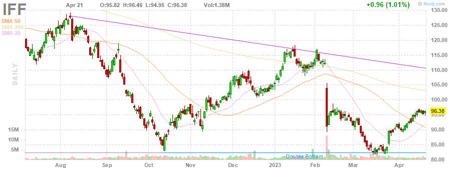
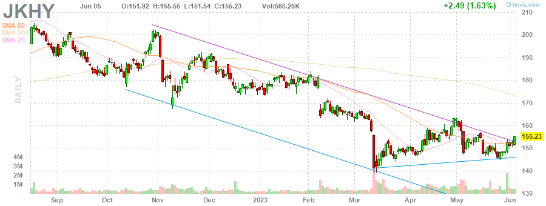
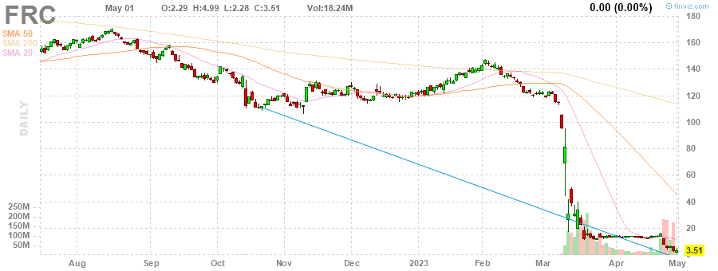
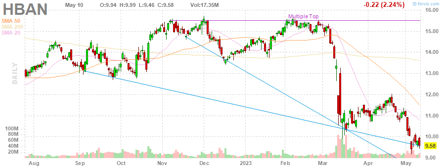
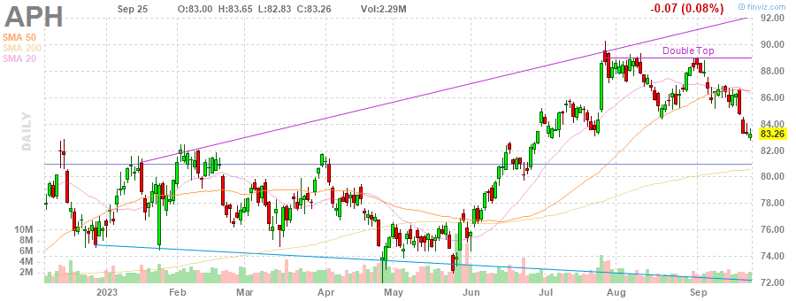
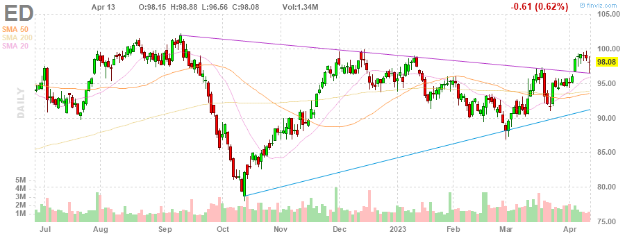

# MarksMan 

MarksMan is an automated bot for the U.S. Stock Market that can trade options using a custom quant algorithm. The bot is capable of reading and detecting alerts in real time, scan for unusual volumes, play options based on unusual options flow and take profits at its liking. Additionally, the bot is capable to detect several chart patterns across S&P500 and NASDAQ100 Markets, generate charts and labels, get OI/Volume for each stock and get real time options ask/bid.

# Daily Newsletter
*Last Updated: 2023-03-28 14:16:05.224970*
---
# BULLISH STOCKS
---
**Multiple Bottoms**

(1) INTC - Intel Corporation

(2) UDR - UDR, Inc.

(3) MDT - Medtronic plc

(4) SWK - Stanley Black & Decker, Inc.

---
**Double Bottom Pattern**

(1) IFF - International Flavors & Fragrances Inc.

(2) DXC - DXC Technology Company

(3) SBAC - SBA Communications Corporation

---
**Falling Wedge Pattern**

(1) SO - The Southern Company

(2) JKHY - Jack Henry & Associates, Inc.

(3) ACN - Accenture plc

(4) COST - Costco Wholesale Corporation

(5) MCD - McDonald's Corporation

---
**Descending Triangle Pattern**

(1) FDS - FactSet Research Systems Inc.

(2) HUM - Humana Inc.

---
**Trendline Support**

(1) NWS - News Corporation

(2) LHX - L3Harris Technologies, Inc.

(3) HLT - Hilton Worldwide Holdings Inc.

(4) WTW - Willis Towers Watson Public Limited Company

---
**Horizontal S/R**

(1) FDS - FactSet Research Systems Inc.

(2) NWS - News Corporation

---
**Oversold Stock**

(1) FRC - First Republic Bank

---

# BEARISH STOCKS 
---

---
**Head and Shoulders Pattern**

(1) HAL - Halliburton Company

(2) ILMN - Illumina, Inc.

(3) BIIB - Biogen Inc.

(4) ALB - Albemarle Corporation

(5) ABBV - AbbVie Inc.

---
**Multiple Top**

(1) HBAN - Huntington Bancshares Incorporated

(2) DXCM - DexCom, Inc.

(3) ROST - Ross Stores, Inc.

---
**Double Top Pattern**

(1) NUE - Nucor Corporation

(2) AZO - AutoZone, Inc.

(3) VRTX - Vertex Pharmaceuticals Incorporated

(4) ORLY - O'Reilly Automotive, Inc.

(5) CVX - Chevron Corporation

(6) PSX - Phillips 66

---
**Ascending Channel Pattern**

(1) VRSK - Verisk Analytics, Inc.

(2) TDY - Teledyne Technologies Incorporated

(3) APH - Amphenol Corporation

(4) ANET - Arista Networks, Inc.

(5) NVR - NVR, Inc.

---
**Rising Wedge Pattern**

(1) PWR - Quanta Services, Inc.

(2) LIN - Linde plc

(3) TTWO - Take-Two Interactive Software, Inc.

(4) AMAT - Applied Materials, Inc.

(5) BIO - Bio-Rad Laboratories, Inc.

---
**Ascending Triangle**

(1) DRI - Darden Restaurants, Inc.

---
**Trendline Resistance**

(1) PWR - Quanta Services, Inc.

(2) TDY - Teledyne Technologies Incorporated

(3) ED - Consolidated Edison, Inc.

(4) CME - CME Group Inc.

(5) CBOE - Cboe Global Markets, Inc.

(6) AEE - Ameren Corporation

---
**Horizontal S/R**. It can be played as bearish if stock loses the support

(1) FDS - FactSet Research Systems Inc.

(2) NWS - News Corporation

---
