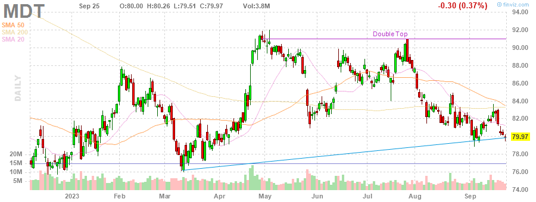
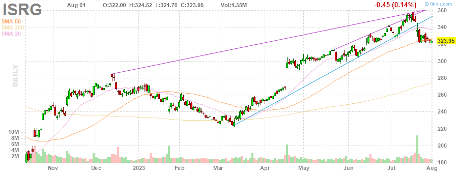
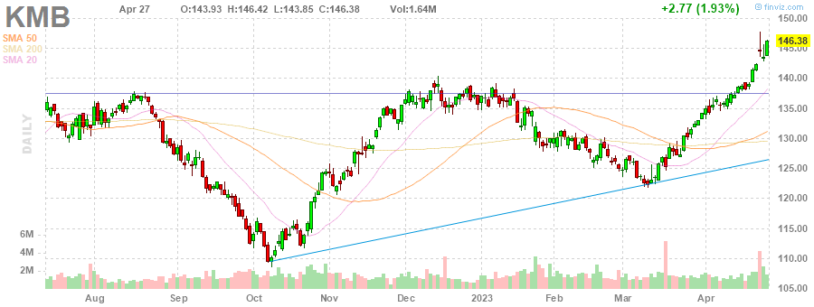

# MarksMan 

MarksMan is an automated bot for the U.S. Stock Market that can trade options using a custom quant algorithm. The bot is capable of reading and detecting alerts in real time, scan for unusual volumes, play options based on unusual options flow and take profits at its liking. Additionally, the bot is capable to detect several chart patterns across S&P500 and NASDAQ100 Markets, generate charts and labels, get OI/Volume for each stock and get real time options ask/bid.

# Daily Newsletter
*Last Updated: 2023-04-25 08:30:00.571254*
---
# BULLISH STOCKS
---
Inverse Head and Shoulders

(1) AAPL - Apple Inc.

---
**Multiple Bottoms**

(1) NRG - NRG Energy, Inc.

(2) INTC - Intel Corporation

(3) FTNT - Fortinet, Inc.

(4) SWK - Stanley Black & Decker, Inc.

(5) MDT - Medtronic plc

---
**Double Bottom Pattern**

(1) CMA - Comerica Incorporated

(2) LYV - Live Nation Entertainment, Inc.

(3) STZ - Constellation Brands, Inc.

(4) DLR - Digital Realty Trust, Inc.

(5) WHR - Whirlpool Corporation

(6) SEE - Sealed Air Corporation

(7) DTE - DTE Energy Company

---
**Descending Channel Pattern**

(1) DISH - DISH Network Corporation

(2) IEX - IDEX Corporation

---
**Falling Wedge Pattern**

(1) ACN - Accenture plc

---
**Descending Triangle Pattern**

(1) FDS - FactSet Research Systems Inc.

---
**Trendline Support**

(1) MPC - Marathon Petroleum Corporation

---
**Horizontal S/R**

(1) CAH - Cardinal Health, Inc.

---

# BEARISH STOCKS 
---

---
**Head and Shoulders Pattern**

(1) STT - State Street Corporation

(2) HAL - Halliburton Company

(3) KLAC - KLA Corporation

(4) NFLX - Netflix, Inc.

---
**Multiple Top**

(1) LMT - Lockheed Martin Corporation

(2) HBAN - Huntington Bancshares Incorporated

(3) ROST - Ross Stores, Inc.

(4) BA - The Boeing Company

(5) WFC - Wells Fargo & Company

(6) GL - Globe Life Inc.

---
**Double Top Pattern**

(1) NCLH - Norwegian Cruise Line Holdings Ltd.

(2) WYNN - Wynn Resorts, Limited

(3) CVX - Chevron Corporation

(4) NUE - Nucor Corporation

(5) CTAS - Cintas Corporation

---
**Ascending Channel Pattern**

(1) TDY - Teledyne Technologies Incorporated

(2) CCL - Carnival Corporation & plc

(3) NVR - NVR, Inc.

(4) VRSK - Verisk Analytics, Inc.

---
**Rising Wedge Pattern**

(1) MPC - Marathon Petroleum Corporation

(2) APH - Amphenol Corporation

(3) PWR - Quanta Services, Inc.

(4) ULTA - Ulta Beauty, Inc.

(5) DRI - Darden Restaurants, Inc.

(6) SNPS - Synopsys, Inc.

(7) TTWO - Take-Two Interactive Software, Inc.

---
**Ascending Triangle**

(1) BG - Bunge Limited

---
**Trendline Resistance**

(1) TDY - Teledyne Technologies Incorporated

(2) CLX - The Clorox Company

(3) ES - Eversource Energy

(4) AMT - American Tower Corporation

---
**Horizontal S/R**. It can be played as bearish if stock loses the support

(1) CAH - Cardinal Health, Inc.

---
**Overbought Stock**

(1) ISRG - Intuitive Surgical, Inc.

(2) MCD - McDonald's Corporation

(3) KMB - Kimberly-Clark Corporation

---
