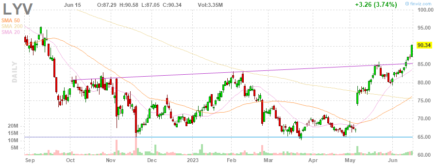
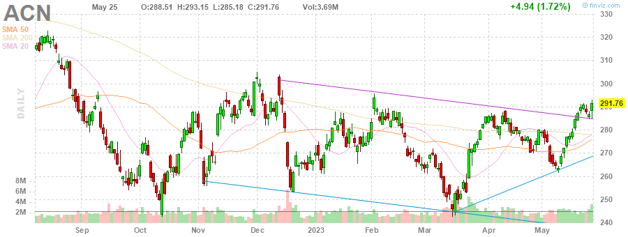
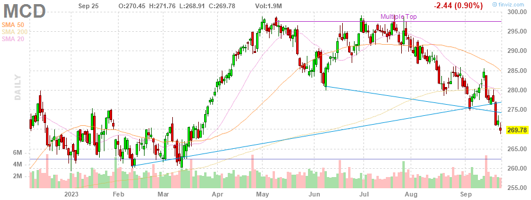
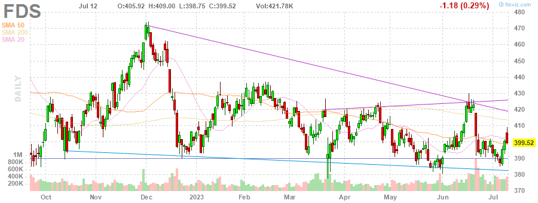
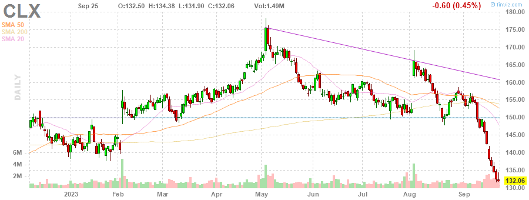

# MarksMan 

MarksMan is an automated bot for the U.S. Stock Market that can trade options using a custom quant algorithm. The bot is capable of reading and detecting alerts in real time, scan for unusual volumes, play options based on unusual options flow and take profits at its liking. Additionally, the bot is capable to detect several chart patterns across S&P500 and NASDAQ100 Markets, generate charts and labels, get OI/Volume for each stock and get real time options ask/bid.

# Daily Newsletter
*Last Updated: 2023-03-31 08:30:00.455208*
---
# BULLISH STOCKS
---
Inverse Head and Shoulders

(1) AAPL - Apple Inc.

---
**Multiple Bottoms**

(1) UDR - UDR, Inc.

(2) MDT - Medtronic plc

---
**Double Bottom Pattern**

(1) CHRW - C.H. Robinson Worldwide, Inc.

(2) CCI - Crown Castle Inc.

(3) LYV - Live Nation Entertainment, Inc.

(4) DXC - DXC Technology Company

(5) SEE - Sealed Air Corporation

(6) INTC - Intel Corporation

(7) IFF - International Flavors & Fragrances Inc.

---
**Falling Wedge Pattern**

(1) ACN - Accenture plc

(2) JKHY - Jack Henry & Associates, Inc.

(3) COST - Costco Wholesale Corporation

(4) MCD - McDonald's Corporation

---
**Descending Triangle Pattern**

(1) FDS - FactSet Research Systems Inc.

---
**Trendline Support**

(1) MPC - Marathon Petroleum Corporation

(2) HLT - Hilton Worldwide Holdings Inc.

(3) NCLH - Norwegian Cruise Line Holdings Ltd.

(4) WTW - Willis Towers Watson Public Limited Company

(5) EQR - Equity Residential

---
**Horizontal S/R**

(1) CLX - The Clorox Company

(2) CCL - Carnival Corporation & plc

(3) FDS - FactSet Research Systems Inc.

---
**Oversold Stock**

(1) FRC - First Republic Bank

---

# BEARISH STOCKS 
---

---
**Head and Shoulders Pattern**

(1) HAL - Halliburton Company

(2) ILMN - Illumina, Inc.

(3) BIIB - Biogen Inc.

(4) ALB - Albemarle Corporation

(5) ABBV - AbbVie Inc.

---
**Multiple Top**

(1) HBAN - Huntington Bancshares Incorporated

(2) DXCM - DexCom, Inc.

(3) ROST - Ross Stores, Inc.

---
**Double Top Pattern**

(1) NCLH - Norwegian Cruise Line Holdings Ltd.

(2) NUE - Nucor Corporation

(3) AZO - AutoZone, Inc.

(4) VRTX - Vertex Pharmaceuticals Incorporated

(5) ORLY - O'Reilly Automotive, Inc.

(6) RTX - Raytheon Technologies Corporation

(7) WFC - Wells Fargo & Company

(8) PSX - Phillips 66

---
**Ascending Channel Pattern**

(1) TDY - Teledyne Technologies Incorporated

(2) VRSK - Verisk Analytics, Inc.

(3) APH - Amphenol Corporation

(4) NVR - NVR, Inc.

(5) NXPI - NXP Semiconductors N.V.

---
**Rising Wedge Pattern**

(1) LIN - Linde plc

(2) PWR - Quanta Services, Inc.

(3) AMAT - Applied Materials, Inc.

(4) TTWO - Take-Two Interactive Software, Inc.

---
**Ascending Triangle**

(1) DRI - Darden Restaurants, Inc.

---
**Trendline Resistance**

(1) PWR - Quanta Services, Inc.

(2) TDY - Teledyne Technologies Incorporated

(3) CBOE - Cboe Global Markets, Inc.

(4) AEE - Ameren Corporation

(5) ED - Consolidated Edison, Inc.

(6) MU - Micron Technology, Inc.

(7) CNP - CenterPoint Energy, Inc.

---
**Horizontal S/R**. It can be played as bearish if stock loses the support

(1) CLX - The Clorox Company

(2) CCL - Carnival Corporation & plc

(3) FDS - FactSet Research Systems Inc.

---
