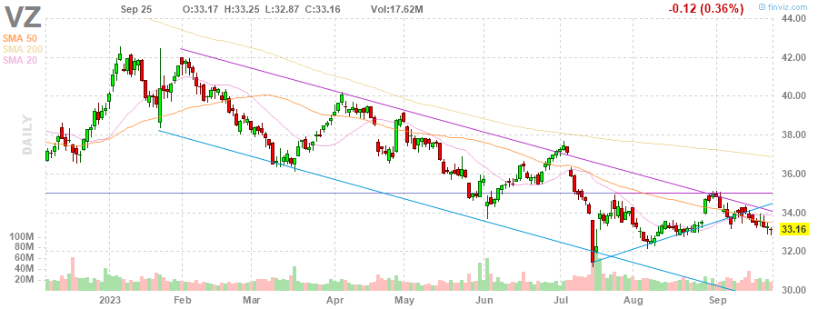
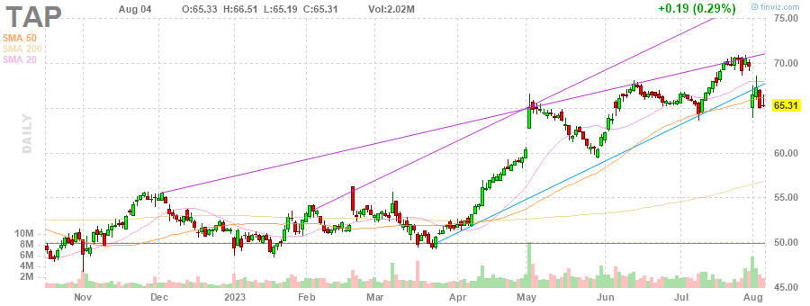
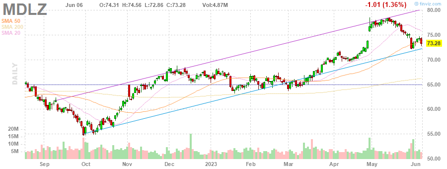

# MarksMan 

MarksMan is an automated bot for the U.S. Stock Market that can trade options using a custom quant algorithm. The bot is capable of reading and detecting alerts in real time, scan for unusual volumes, play options based on unusual options flow and take profits at its liking. Additionally, the bot is capable to detect several chart patterns across S&P500 and NASDAQ100 Markets, generate charts and labels, get OI/Volume for each stock and get real time options ask/bid.

# Daily Newsletter
*Last Updated: 2023-05-05 08:30:00.613199*
---
# BULLISH STOCKS
---
Inverse Head and Shoulders

(1) AAPL - Apple Inc.

---
**Multiple Bottoms**

(1) LYV - Live Nation Entertainment, Inc.

(2) CTLT - Catalent, Inc.

(3) MDT - Medtronic plc

---
**Descending Channel Pattern**

(1) DHR - Danaher Corporation

(2) TSN - Tyson Foods, Inc.

(3) IEX - IDEX Corporation

---
**Falling Wedge Pattern**

(1) AAP - Advance Auto Parts, Inc.

(2) PAYX - Paychex, Inc.

---
**Descending Triangle Pattern**

(1) FTV - Fortive Corporation

(2) AMCR - Amcor plc

---
**Trendline Support**

(1) PAYC - Paycom Software, Inc.

(2) NCLH - Norwegian Cruise Line Holdings Ltd.

(3) PNR - Pentair plc

(4) UDR - UDR, Inc.

---
**Horizontal S/R**

(1) FDS - FactSet Research Systems Inc.

(2) UDR - UDR, Inc.

(3) IRM - Iron Mountain Incorporated

---

# BEARISH STOCKS 
---

---
**Head and Shoulders Pattern**

(1) STLD - Steel Dynamics, Inc.

(2) NFLX - Netflix, Inc.

(3) UAL - United Airlines Holdings, Inc.

(4) BKR - Baker Hughes Company

(5) KLAC - KLA Corporation

(6) SLB - Schlumberger Limited

(7) STT - State Street Corporation

(8) SPG - Simon Property Group, Inc.

(9) CB - Chubb Limited

(10) DGX - Quest Diagnostics Incorporated

(11) TRV - The Travelers Companies, Inc.

---
**Multiple Top**

(1) JPM - JPMorgan Chase & Co.

(2) WYNN - Wynn Resorts, Limited

(3) UHS - Universal Health Services, Inc.

(4) BA - The Boeing Company

(5) HBAN - Huntington Bancshares Incorporated

(6) CTAS - Cintas Corporation

(7) ROST - Ross Stores, Inc.

(8) APH - Amphenol Corporation

(9) XOM - Exxon Mobil Corporation

---
**Double Top Pattern**

(1) MGM - MGM Resorts International

(2) CAH - Cardinal Health, Inc.

(3) ALGN - Align Technology, Inc.

(4) WMT - Walmart Inc.

(5) GWW - W.W. Grainger, Inc.

(6) NUE - Nucor Corporation

---
**Ascending Channel Pattern**

(1) TDY - Teledyne Technologies Incorporated

(2) CCL - Carnival Corporation & plc

(3) NVR - NVR, Inc.

(4) VRTX - Vertex Pharmaceuticals Incorporated

(5) ORLY - O'Reilly Automotive, Inc.

(6) TTWO - Take-Two Interactive Software, Inc.

---
**Rising Wedge Pattern**

(1) PWR - Quanta Services, Inc.

(2) LIN - Linde plc

(3) DXCM - DexCom, Inc.

(4) BKNG - Booking Holdings Inc.

(5) SNPS - Synopsys, Inc.

(6) ULTA - Ulta Beauty, Inc.

(7) IDXX - IDEXX Laboratories, Inc.

---
**Ascending Triangle**

(1) BG - Bunge Limited

---
**Trendline Resistance**

(1) CSX - CSX Corporation

(2) HCA - HCA Healthcare, Inc.

(3) COST - Costco Wholesale Corporation

(4) AMT - American Tower Corporation

(5) DHR - Danaher Corporation

(6) ES - Eversource Energy

(7) VZ - Verizon Communications Inc.

(8) PWR - Quanta Services, Inc.

---
**Horizontal S/R**. It can be played as bearish if stock loses the support

(1) FDS - FactSet Research Systems Inc.

(2) UDR - UDR, Inc.

(3) IRM - Iron Mountain Incorporated

---
**Overbought Stock**

(1) TAP - Molson Coors Beverage Company

(2) LLY - Eli Lilly and Company

(3) MDLZ - Mondelez International, Inc.

---
