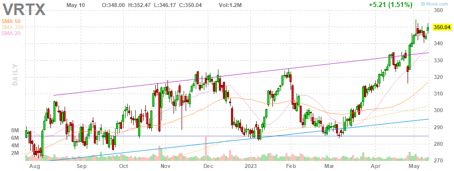

# MarksMan 

MarksMan is an automated bot for the U.S. Stock Market that can trade options using a custom quant algorithm. The bot is capable of reading and detecting alerts in real time, scan for unusual volumes, play options based on unusual options flow and take profits at its liking. Additionally, the bot is capable to detect several chart patterns across S&P500 and NASDAQ100 Markets, generate charts and labels, get OI/Volume for each stock and get real time options ask/bid.

# Daily Newsletter
*Last Updated: 2023-04-02 08:30:00.338546*
---
# BULLISH STOCKS
---
Inverse Head and Shoulders

(1) AAPL - Apple Inc.

---
**Multiple Bottoms**

(1) UDR - UDR, Inc.

---
**Double Bottom Pattern**

(1) CHRW - C.H. Robinson Worldwide, Inc.

(2) CCI - Crown Castle Inc.

(3) LYV - Live Nation Entertainment, Inc.

(4) DXC - DXC Technology Company

(5) SEE - Sealed Air Corporation

(6) INTC - Intel Corporation

---
**Falling Wedge Pattern**

(1) ACN - Accenture plc

(2) JKHY - Jack Henry & Associates, Inc.

(3) COST - Costco Wholesale Corporation

---
**Trendline Support**

(1) MPC - Marathon Petroleum Corporation

(2) NCLH - Norwegian Cruise Line Holdings Ltd.

(3) WTW - Willis Towers Watson Public Limited Company

(4) EQR - Equity Residential

---
**Horizontal S/R**

(1) CCL - Carnival Corporation & plc

---
**Oversold Stock**

(1) FRC - First Republic Bank

---

# BEARISH STOCKS 
---

---
**Head and Shoulders Pattern**

(1) HAL - Halliburton Company

(2) BIIB - Biogen Inc.

(3) ALB - Albemarle Corporation

---
**Multiple Top**

(1) HBAN - Huntington Bancshares Incorporated

(2) DXCM - DexCom, Inc.

(3) ROST - Ross Stores, Inc.

---
**Double Top Pattern**

(1) CVX - Chevron Corporation

(2) NCLH - Norwegian Cruise Line Holdings Ltd.

(3) NUE - Nucor Corporation

(4) AZO - AutoZone, Inc.

(5) VRTX - Vertex Pharmaceuticals Incorporated

(6) ORLY - O'Reilly Automotive, Inc.

(7) WFC - Wells Fargo & Company

---
**Ascending Channel Pattern**

(1) TDY - Teledyne Technologies Incorporated

(2) VRSK - Verisk Analytics, Inc.

(3) APH - Amphenol Corporation

(4) NVR - NVR, Inc.

(5) NXPI - NXP Semiconductors N.V.

---
**Rising Wedge Pattern**

(1) LIN - Linde plc

(2) PWR - Quanta Services, Inc.

(3) CSCO - Cisco Systems, Inc.

(4) AMAT - Applied Materials, Inc.

(5) TTWO - Take-Two Interactive Software, Inc.

---
**Ascending Triangle**

(1) DRI - Darden Restaurants, Inc.

---
**Trendline Resistance**

(1) ED - Consolidated Edison, Inc.

(2) PWR - Quanta Services, Inc.

(3) TDY - Teledyne Technologies Incorporated

(4) AEE - Ameren Corporation

(5) CBOE - Cboe Global Markets, Inc.

---
**Horizontal S/R**. It can be played as bearish if stock loses the support

(1) CCL - Carnival Corporation & plc

---
