# MarksMan 

MarksMan is an automated bot for the U.S. Stock Market that can trade options using a custom quant algorithm. The bot is capable of reading and detecting alerts in real time, scan for unusual volumes, play options based on unusual options flow and take profits at its liking. Additionally, the bot is capable to detect several chart patterns across S&P500 and NASDAQ100 Markets, generate charts and labels, get OI/Volume for each stock and get real time options ask/bid.

# Daily Newsletter
*Last Updated: 2023-04-20 08:30:00.825459*
---
# BULLISH STOCKS
---
Inverse Head and Shoulders

(1) AAPL - Apple Inc.

---
**Multiple Bottoms**

(1) NRG - NRG Energy, Inc.

(2) CTLT - Catalent, Inc.

(3) FTNT - Fortinet, Inc.

(4) INTC - Intel Corporation

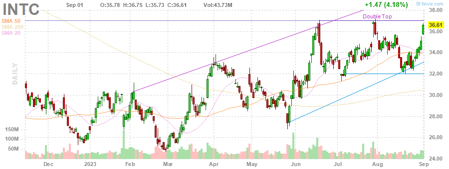

(5) SWK - Stanley Black & Decker, Inc.

(6) RMD - ResMed Inc.

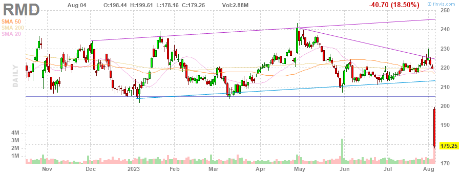

(7) MDT - Medtronic plc

---
**Double Bottom Pattern**

(1) IFF - International Flavors & Fragrances Inc.

(2) STZ - Constellation Brands, Inc.

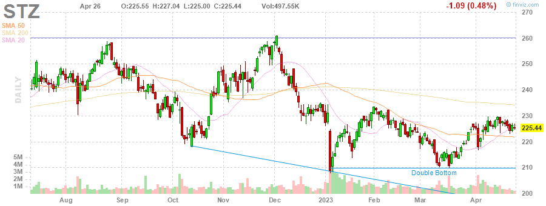

(3) DLR - Digital Realty Trust, Inc.

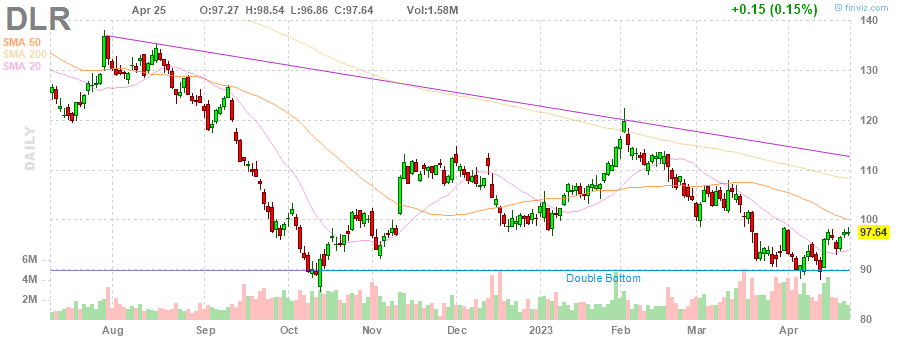

(4) CCI - Crown Castle Inc.

(5) CMA - Comerica Incorporated

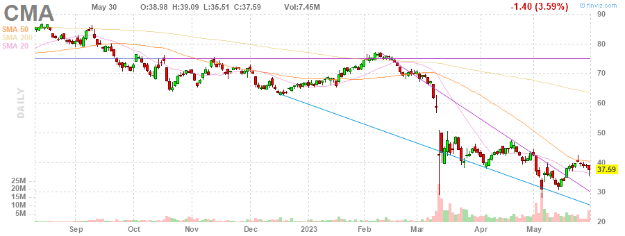

(6) SEE - Sealed Air Corporation

(7) DTE - DTE Energy Company

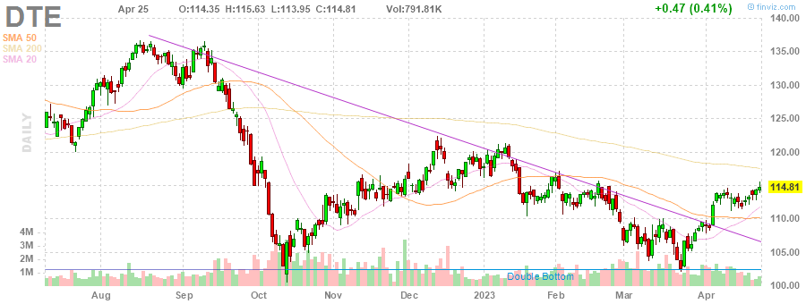

---
**Descending Channel Pattern**

(1) DISH - DISH Network Corporation

(2) IEX - IDEX Corporation

---
**Falling Wedge Pattern**

(1) ACN - Accenture plc

(2) JKHY - Jack Henry & Associates, Inc.

---
**Descending Triangle Pattern**

(1) FDS - FactSet Research Systems Inc.

---
**Trendline Support**

(1) MPC - Marathon Petroleum Corporation

---

# BEARISH STOCKS 
---

---
**Head and Shoulders Pattern**

(1) NFLX - Netflix, Inc.

(2) SNA - Snap-on Incorporated

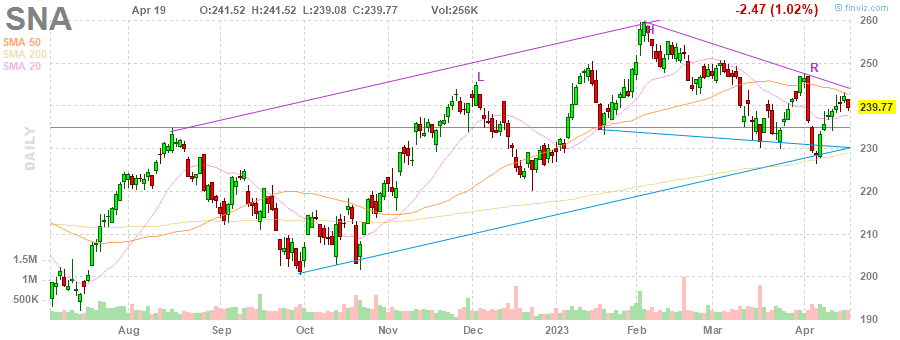

(3) STT - State Street Corporation

(4) HAL - Halliburton Company

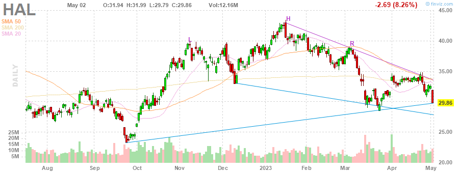

(5) KLAC - KLA Corporation

(6) BIIB - Biogen Inc.

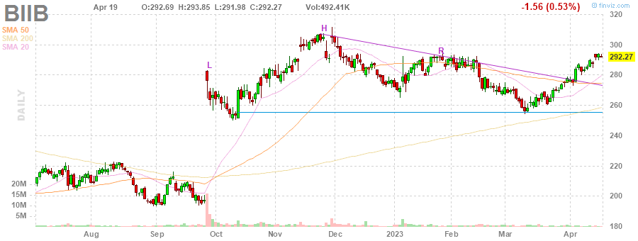

---
**Multiple Top**

(1) FICO - Fair Isaac Corporation

(2) HBAN - Huntington Bancshares Incorporated

(3) ROST - Ross Stores, Inc.

(4) BA - The Boeing Company

(5) GL - Globe Life Inc.

(6) WFC - Wells Fargo & Company

---
**Double Top Pattern**

(1) CTAS - Cintas Corporation

(2) CVX - Chevron Corporation

(3) NUE - Nucor Corporation

(4) WYNN - Wynn Resorts, Limited

(5) PSX - Phillips 66

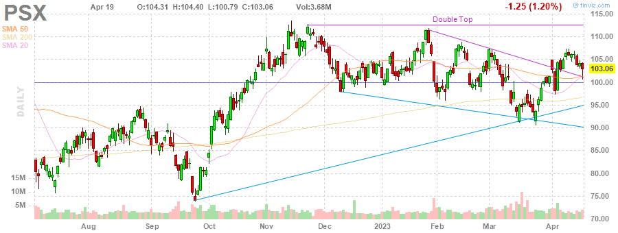

---
**Ascending Channel Pattern**

(1) TDY - Teledyne Technologies Incorporated

(2) APH - Amphenol Corporation

(3) CCL - Carnival Corporation & plc

(4) VRSK - Verisk Analytics, Inc.

(5) NVR - NVR, Inc.

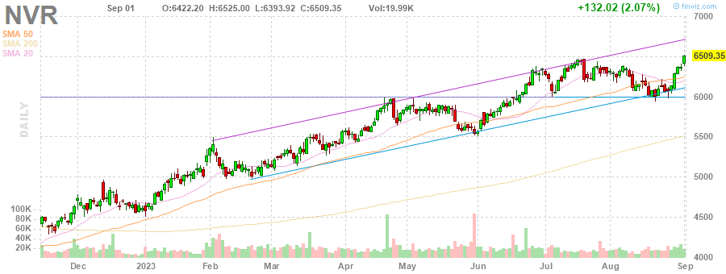

---
**Rising Wedge Pattern**

(1) MPC - Marathon Petroleum Corporation

(2) BSX - Boston Scientific Corporation

(3) PWR - Quanta Services, Inc.

(4) ULTA - Ulta Beauty, Inc.

(5) DRI - Darden Restaurants, Inc.

(6) TTWO - Take-Two Interactive Software, Inc.

(7) SNPS - Synopsys, Inc.

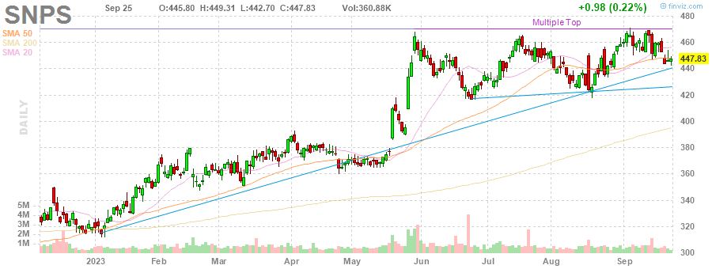

---
**Ascending Triangle**

(1) BG - Bunge Limited

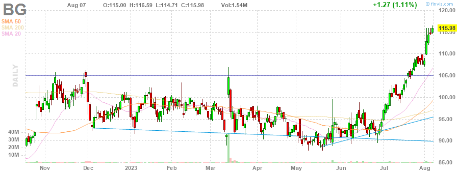

---
**Trendline Resistance**

(1) TDY - Teledyne Technologies Incorporated

(2) AEE - Ameren Corporation

(3) CLX - The Clorox Company

---
**Overbought Stock**

(1) ISRG - Intuitive Surgical, Inc.

(2) MCD - McDonald's Corporation

---
